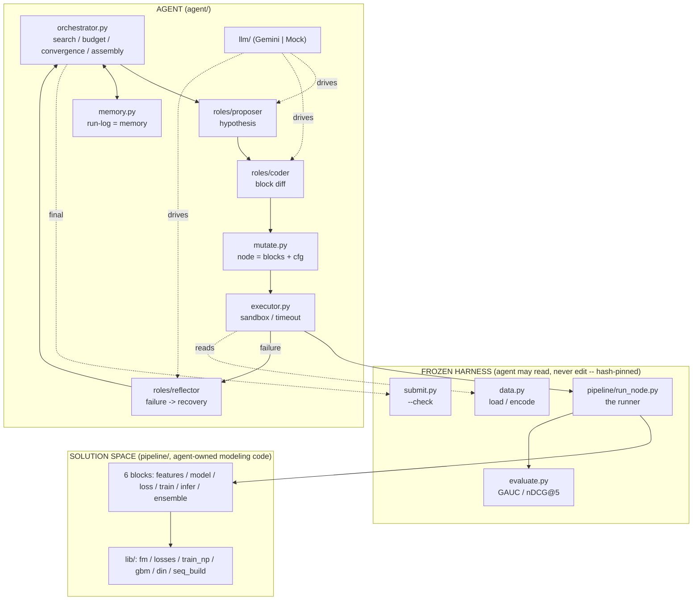

# Autonomous ML Research Agent — KuaiRand-Pure
**TikTok TechJam 2026 · Track 2 (Autonomous ML Research Agent for Recommender Systems)**

An LLM-driven agent that runs the **entire machine-learning research loop by itself** — read the
problem, engineer features, write model code, train, evaluate, reflect, and iterate — on the
KuaiRand-Pure video-ranking benchmark. It reproduces the official Factorization-Machine baseline,
then autonomously proposes and codes improvements (ranking losses, a gradient-boosted ranker, a
Deep-Interest-Network sequence model), and finally **assembles them into an ensemble** that beats
the baseline — writing a full research log and a validated submission with **zero human
intervention**.

> **Result of the reference (scripted) run:** FM baseline `primary = 0.6015` → agent ensemble **`0.6050`**
> (FM + DIN + LightGBM, rank-blended), submission passes `submit.py --check`, ~700 LLM tokens, ~6 min
> wall-clock, **0 runtime interventions**. This run replays scripted `MockDriver` moves
> (`tests/mock_moves.py`) to exercise the full machinery deterministically; **live LLM-driven autonomy
> (Gemini) is evaluated separately** — see §14.

This README is the **single source of truth**. It documents the system from the macro architecture
down to every file and every important function, and explains the math and the reasoning behind each
decision. Four companion docs go deeper where noted:

- **[docs/DESIGN.md](docs/DESIGN.md)** — the *why*: the research context (AIDE / MLE-STAR / AI-Scientist /
  RD-Agent), the two-layer thesis, why best-first search over MCTS, the loss↔metric insight, the
  rubric-driven design decisions, and the alternatives considered.
- **[docs/MATH.md](docs/MATH.md)** — the *math*: full derivations of the metrics (GAUC, nDCG), the FM
  forward pass and gradient, BPR and softmax-CE losses and why they are AUC / nDCG surrogates,
  LightGBM LambdaRank, and the DeepFM+DIN attention model.
- **[docs/INTEGRATION.md](docs/INTEGRATION.md)** — the *what we adopted*: six features integrated from
  three teammate archives (Aerin, JX, Jonathan) — multi-task heads, the hypothesis-ledger dashboard,
  cross-run champion resume, multi-seed re-eval, debug-first sample gate, and test-label data guard.
- **[docs/IMPLEMENTATION.md](docs/IMPLEMENTATION.md)** — the *how*: code-level build specs for all six
  integrated features, with reference code, verification steps, and edge-case guards.
- **[docs/COMPARE.md](docs/COMPARE.md)** — *archive analysis*: architectural comparison of all teammate
  codebases and the rationale for what was adopted vs. rejected.
- **[docs/PROBLEM_STATEMENT.pdf](docs/PROBLEM_STATEMENT.pdf)** — the official challenge.

---

## Table of contents

1. [Quick start](#1-quick-start)
2. [The problem in one screen](#2-the-problem-in-one-screen)
3. [Architecture at a glance (macro)](#3-architecture-at-a-glance-macro)
4. [Repository map (every file)](#4-repository-map-every-file)
5. [The fixed harness (frozen)](#5-the-fixed-harness-frozen)
6. [Data & caching](#6-data--caching)
7. [The block contract & the node runner](#7-the-block-contract--the-node-runner)
8. [The solution space — the levers](#8-the-solution-space--the-levers)
9. [The agent — how it searches](#9-the-agent--how-it-searches)
10. [End-to-end: a worked run](#10-end-to-end-a-worked-run)
11. [Results & empirical findings](#11-results--empirical-findings)
12. [How it maps to the judging rubric](#12-how-it-maps-to-the-judging-rubric)
13. [Environment & constraints](#13-environment--constraints)
14. [Honest status, limitations, next steps](#14-honest-status-limitations-next-steps)

---

## 1. Quick start

```bash
# 1. Install (Python 3.10+; a venv is recommended)
pip install numpy torch lightgbm google-genai pydantic pyyaml scipy

# 2. Get the data (~195 MB, no registration) — run inside the repo root
wget https://zenodo.org/records/10439422/files/KuaiRand-Pure.tar.gz
tar xzf KuaiRand-Pure.tar.gz            # gives ./KuaiRand-Pure/data/

# 3. Run the agent
python -m agent.run --smoke     # M0 gate: build the cache, reproduce FM (~0.6015). No LLM.
python -m agent.run --mock      # full autonomous loop, scripted MockDriver (no API, no credits)
python -m agent.run --faults    # robustness demo: inject failures, verify recovery
python -m agent.run             # LIVE run driven by the Gemini API (needs GEMINI_API_KEY)
```

`GEMINI_API_KEY` is read from the environment or from a `.env.local` file (`GEMINI_API_KEY=...`) in the
repo root. Every run writes to `runs/<run_id>/`:

| File | What |
|---|---|
| `run_log.jsonl` | one line per iteration: `{hypothesis, code_diff, metrics, events, cost, ...}` — the research log **and** the agent's memory |
| `resource_report.json` | final score, delta over FM, ensemble info, per-lever ablation, tokens + wall-clock |
| `results.md` | a short results table |
| `best/submission_test.csv` | the final submission (passes `submit.py --check`) |
| `nodes/<id>/` | each experiment: its `blocks/` snapshot, `cfg.json`, `metrics.json`, `*_scores.npy`, `stdout.log` |

The first run builds `runs/_cache/` (base features + LightGBM features + DIN sequences) in ~45 s; every
run after reuses it.

> **Compute note:** this machine runs **Python 3.14**, for which **PyTorch ships no CUDA wheels**, so the
> DIN model trains on CPU (~80 s/epoch, converges in ~2). The code auto-detects `torch.cuda.is_available()`
> and uses a GPU the moment one is available under a supported Python (3.11/3.12) — no code change. See
> [§13](#13-environment--constraints).

---

## 2. The problem in one screen

KuaiRand-Pure is a short-video feedback log. The task, fixed by the organizers and hard-coded in
`evaluate.py`, is **within-user ranking**: for each user, rank *that user's own* logged impressions by
how likely each is a `long_view` (a binary watch-completion signal). Nothing is retrieved from a global
catalog — the candidate set per user is just their logged rows.

| | |
|---|---|
| **Label** | `long_view` (native 0/1 column) |
| **Metrics** | `GAUC` (per-user AUC, weighted by #positives) and `nDCG@5`; **primary = mean of the two** |
| **Splits (by date)** | train `04/08–04/21` (1.14 M rows) · valid `04/22–04/28` (125 K) · test `04/29–05/08` (171 K) |
| **FM baseline** | primary **0.6015** (valid) / 0.5946 (test) |
| **Oracle ceiling** | primary **0.8484** (valid) / 0.8645 (test) — <1.0 because 27 % of users are all-negative (nDCG fixed at 0) and 9 % all-positive |
| **Goal** | develop on train+valid only; **beat the FM baseline**; the score is the *converged* validation-best, evaluated once on the hidden test |

The FM baseline already captures ~31 % of the attainable range, so the remaining headroom is small and
hard-won — the point of this project is the **autonomous agent that discovers and combines gains**, not a
hand-tuned SOTA number. Full metric definitions (Mann-Whitney AUC, the nDCG discount, why the ceiling is
0.86) are in **[docs/MATH.md §1](docs/MATH.md#1-the-metrics)**.

---

## 3. Architecture at a glance (macro)

The system has **two layers**, connected by a strict trust boundary.

- **Layer 1 — the solution space** (`pipeline/`): the space of RecSys models the agent can build,
  expressed as a small, contract-bound *pipeline* it edits.
- **Layer 2 — the agent** (`agent/`): a hypothesis-driven **best-first tree search** that proposes
  changes, writes code, runs them, learns from the results, recovers from failures, and assembles an
  ensemble.



**The trust boundary (the most important design decision):** the agent **reads** `data.py`,
`evaluate.py`, `submit.py`, and `run_node.py` and **writes** everything downstream of them — the six
*block* function bodies that define features, model, loss, training, inference, and ensembling. The
frozen files are SHA-256-pinned (`agent/guardrails.py`), so the agent can never — accidentally or
otherwise — change the code the score depends on. This shrinks the failure surface and makes every run
trustworthy. The *why* is in **[docs/DESIGN.md](docs/DESIGN.md#the-trust-boundary)**.

**One node = one experiment.** A node is a snapshot of the six block source files plus a `Cfg`. The agent
mutates a node either by a cheap **config change** (edit `Cfg` values) or a **block edit** (the Coder
rewrites one block's body) or a **block-set adoption** (swap in a pre-built model family like `lgbm` or
`din`). A fixed runner assembles and executes the snapshot in an isolated subprocess. This is a
deliberately safe realization of "the agent owns the modeling code."

---

## 4. Repository map (every file)

Grouped by role. "Frozen" files are hash-pinned and never edited by the agent.

### Fixed harness (starter kit — frozen) — [details §5](#5-the-fixed-harness-frozen)
| File | Purpose |
|---|---|
| `data.py` | Load the logs, apply the official date split, encode the 5 categorical fields into a flat FM index space |
| `evaluate.py` | The official metrics: `auc` (Mann-Whitney U), `ndcg_at_k`, `evaluate` (GAUC + nDCG@5 + primary) |
| `submit.py` | Generate / validate / score submission CSVs (`--make` / `--check` / `--score`) |
| `baseline.py` | The three official baselines: `random`, `pop`, and the `FM` to beat |
| `baseline_scores.json` | Published reference scores, seed variance, convergence rule |
| `ablation_features.py` | Organizer script proving "adding static features doesn't help" (not used by the agent) |

### Agent (`agent/`) — [details §9](#9-the-agent--how-it-searches)
| File | Purpose |
|---|---|
| `run.py` | CLI entry point: `--smoke` / `--mock` / `--faults` / live; `.env.local` key loading |
| `config.py` | `Config`, `Budget`, `Phases`, `LLM` — all tunable knobs and model names |
| `orchestrator.py` | **The control loop**: best-first tree search, phases, budget, convergence, recovery, Phase-3 assembly, finalize |
| `tree.py` | `Node` + `SearchTree` (best-first selection with an exploration valve) |
| `memory.py` | Append-only `run_log.jsonl` — the agent's memory, dedup index, and deliverable |
| `mutate.py` | Turn a hypothesis into a node on disk (snapshot blocks, apply cfg delta, diff) |
| `executor.py` | Sandboxed subprocess runner, per-iteration timeout, import allowlist, failure classification |
| `guardrails.py` | Immutability enforcement (SHA-256 of the frozen files vs `frozen.lock`) |
| `datced.py` | Build & memory-map the `DataBundle` cache (base + LightGBM + DIN features) |
| `llm/driver.py` | `LLMDriver` interface, `Usage`, and `MockDriver` (drives the whole loop offline) |
| `llm/gemini.py` | `GeminiDriver` — google-genai, structured output, retry/backoff, token accounting |
| `llm/schemas.py` | Pydantic schemas the LLM must return: `Hypothesis`, `BlockEdit`, `RecoveryAction`, `AblationRead` |
| `roles/{proposer,coder,reflector}.py` | The three role wrappers (system prompt + a typed `generate` call) |
| `champion.py` | Cross-run champion persistence: save / load the best validated node across runs |
| `reeval.py` | Multi-seed re-evaluation: confirm the submission on seed-mean, not a single lucky seed |

### Solution space (`pipeline/`) — [details §7](#7-the-block-contract--the-node-runner)–[§8](#8-the-solution-space--the-levers)
| File | Purpose |
|---|---|
| `contracts.py` | `Cfg` (every lever knob), `Meta`, `FeatureSet`, and the six block signatures. **Frozen.** |
| `run_node.py` | The fixed runner: assemble the six blocks → train → evaluate → emit metrics + scores. **Frozen.** |
| `debug_cache.py` | Debug-first gate: build a small, row-consistent subsample of the cache for fast-fail smoke runs |
| `baseline_blocks/*.py` | The FM+BCE baseline expressed as blocks; also the ablation control |
| `lib/fm.py` | Numpy Factorization Machine, factored so the loss is pluggable |
| `lib/losses.py` | Lever A: BPR (pairwise), softmax-CE (listwise), BCE — each with a `.mode` for the trainer |
| `lib/train_np.py` | The numpy trainer: point / group / pair batching, early stopping, negative sampling |
| `lib/gbm.py` | Lever D: LightGBM LambdaRank on engineered item/author features |
| `lib/din.py` | Lever B: DeepFM + Deep Interest Network (target attention over history) |
| `lib/seq_build.py` | Lever B data: temporally-safe per-user behavior sequences, cached |
| `lib/lgbm_blocks/*.py` | The adoptable LightGBM model-family block set |
| `lib/din_blocks/*.py` | The adoptable DIN model-family block set |
| `lib/aux_build.py` | Lever C data: per-row auxiliary labels (click/like/follow/comment/forward), cached and row-aligned |

### Tests, dashboard & docs
| File | Purpose |
|---|---|
| `tests/mock_moves.py` | Scripted hypotheses for `MockDriver` — drives `--mock` and `--faults` end-to-end without an API |
| `dashboard/hypothesis-ledger.html` | Standalone client-side dashboard: drag-and-drop `run_log.jsonl` to visualize the search tree, metrics, and cost |
| `docs/DESIGN.md`, `docs/MATH.md` | Design rationale, math derivations |
| `docs/INTEGRATION.md`, `docs/IMPLEMENTATION.md` | Archive integration proposals and code-level build specs for six adopted features |
| `docs/COMPARE.md` | Architectural comparison of teammate codebases (Aerin, JX, Jonathan) |
| `docs/PROBLEM_STATEMENT.pdf` | The official challenge |

---

## 5. The fixed harness (frozen)

These are the organizer's files. They are hash-pinned in `agent/frozen.lock`; the agent reads them but
any edit aborts the run.

### `data.py` — loading, splitting, encoding
- `FIELDS = ['user_id', 'video_id', 'author_id', 'tab', 'dur_bucket']`, `LABEL = 'long_view'`, and the
  three date ranges in `SPLITS`.
- **`load(data_dir)`** reads the two standard log CSVs (and `video_features_basic_pure.csv` for the
  video→author map), parses each row into `(date, user_id, video_id, author_id, tab, duration_ms, label)`,
  and buckets rows into `train/valid/test` by date. File order is preserved (this matters for the
  submission and for the sequence chronology in §6).
- **`encode(splits)`** maps the 5 categorical fields to contiguous integer ids and then to a *single flat
  index space* via cumulative offsets — the standard FM trick so one embedding table covers all fields
  (e.g. `user_17 → 17`, `video_3 → 27000 + 3`). `duration_ms` is discretized into 10 quantile buckets;
  each field reserves an `UNK` slot for values unseen in train. Returns `(enc, dim)` where
  `enc[split] = (X, y, users)`, `X` is `int32 (N, 5)` of offset indices, and `dim` is the total index count.

### `evaluate.py` — the official metrics (the contract everything optimizes)
- **`auc(labels, scores)`** — AUC via the Mann-Whitney U statistic with tie correction (equivalent to
  `sklearn.roc_auc_score`). Numerically stable, no threshold sweeping.
- **`ndcg_at_k(labels, k)`** — labels pre-sorted by predicted score; gain `2^rel − 1` (identity for binary
  labels), discount `log2(i+2)`, normalized by the ideal DCG.
- **`evaluate(user_ids, labels, scores, k=5)`** — groups rows by user, then:
  - **GAUC** = mean of per-user AUC over users with `0 < #positives < #impressions`, **weighted by
    #positives**. Degenerate users (all-pos / all-neg) are excluded (their AUC is undefined).
  - **nDCG@5** = mean over **all** users; all-negative users contribute 0 and *are* counted (this is what
    pulls the ceiling below 1.0).
  - **primary** = `(GAUC + nDCG@5) / 2`.

  Why GAUC is the right quantity to attack with a *pairwise* loss and nDCG with a *listwise* one is derived
  in **[docs/MATH.md §1](docs/MATH.md#1-the-metrics)**.

### `submit.py`, `baseline.py`, `baseline_scores.json`, `ablation_features.py`
- `submit.py --make/--check/--score` builds a submission from a model, validates format + alignment
  (`row_id` contiguous, one row per split row, finite scores), or scores it locally on valid. The agent
  calls `--check` on its final submission in `orchestrator.finalize`.
- `baseline.py` implements `run_random`, `run_pop`, and `run_fm` (the FM to beat: `k=16, lr=1e-3,
  bs=8192, 40 epochs, patience 4`). The agent's *root node* reproduces `run_fm` exactly (§8).
- `baseline_scores.json` records the published scores, the 5-seed std (0.0008), and the convergence rule
  (`ε, N`). `ablation_features.py` is the organizer's proof that static features don't help — the agent
  encodes that as a hard "don't" (the Proposer is told not to propose it).

---

## 6. Data & caching

Re-reading 106 MB of CSV per experiment would dominate the wall-clock budget, so everything is encoded
**once** into memory-mapped `.npy` files under `runs/_cache/` and loaded in well under a second per node.

### `agent/datced.py` — the DataBundle
- **`build_or_load(data_dir, cache_dir, force=False)`** — idempotent. Rebuilds only when the cache is
  missing or `CACHE_VERSION` (currently `5`) changed. It calls the frozen `data.load`/`data.encode` once,
  then reuses those loaded rows to also build the LightGBM features (`gbm.build_features`) and the DIN
  sequences (`seq_build.build`). Saves per split: `X` (offset indices), `y`, `u` (int user codes for
  grouping), and `vid` (raw video ids, needed to write an aligned submission).
- **`load_bundle(cache_dir) → Bundle`** — memory-maps the arrays (`mmap_mode='r'`) into a `Bundle`
  dataclass carrying `X, y, users, dim, n_fields, cache_dir`. The `cache_dir` field lets a block load its
  sibling caches (LightGBM features, DIN sequences) without re-deriving them.

### `pipeline/lib/seq_build.py` — temporally-safe behavior sequences (Lever B data)
For each impression, the *history* is that user's **prior** interactions, truncated to the last `L=30`.
Temporal safety is **structural, not a filter**: rows are processed in global time order
(`train` = file1 < `valid` < `test`), and the current item is appended to the user's rolling history
`deque` **only after** the row's history has been snapshotted — so a row can never see its own outcome or
any future row. `build()` writes `{split}_tgt/seq/slen.npy` (target video id, padded history ids, true
length) plus a video vocab of size `V`; `load_split` / `meta` read them back. The chronology proxy (file
order ≈ time, since KuaiRand logs are time-ordered) is explained in the module docstring.

### LightGBM features (in `pipeline/lib/gbm.py`, cached under `runs/_cache/gbm/`)
`build_features` computes **leakage-safe** per-item and per-author `long_view` rates (smoothed with a
prior, from train only), `log` impression counts, `duration`, `tab`, and the first 16 columns of
`video_features_statistic_pure.csv` (global engagement stats), z-scored on train. The insight (from the
organizers) is that only features that **vary across a user's impressions** carry within-user ranking
signal — item/author-side features do, pure user-side features don't — so the LightGBM feature set is
deliberately item-centric. See [§8](#lever-d--lightgbm-lambdarank).

---

## 7. The block contract & the node runner

### `pipeline/contracts.py` (frozen) — the shapes everything agrees on
- **`Cfg`** — a flat dataclass holding *every* lever knob: seed; feature flags (`use_seq, L, use_vstat,
  use_aux`); model (`model_type, k`); loss (`loss_type, alpha, tau, neg_ratio, lambdarank, group_filter`);
  training (`lr, l2, epochs, batch, patience, grad_clip`); multi-task (`aux_tasks, aux_weights, mtl_arch`);
  debias (`ips`); ensemble (`ensemble_members`). A **config mutation** just changes these values. `Cfg`
  round-trips to/from JSON and produces a stable 12-char `hash()` used for dedup.
- **`Meta`** — `dim`, `field_dims`, `n_fields`: the static description handed to `build_model`.
- **`FeatureSet`** — what a features block returns and model/train/infer consume: `X, y, users, meta`, plus
  optional `seq` (Lever B) and `aux` (Lever C).
- **The six block signatures** (the heart of the contract):
  ```python
  build_features(bundle, cfg) -> FeatureSet
  build_model(meta, cfg)      -> model            # exposes .logits/.apply_grad/.predict, or a wrapper
  build_loss(cfg)             -> lossfn(z, batch) -> (loss, g)     # g = dL/dz per row
  train(model, lossfn, feats, bundle, cfg) -> model                # validation-best, early-stopped
  infer(model, feats, split)  -> np.ndarray        # aligned to bundle row order
  combine(base, cfg)          -> np.ndarray         # assembly phase only
  ```

### `pipeline/run_node.py` (frozen) — the runner
Invoked as a module (`python -m pipeline.run_node --blocks <dir> --out <dir> --cfg <json>`), it
`importlib`-loads the six block files **from the node's snapshot dir** (so concurrent nodes never collide),
then: `feats = build_features(...)` → `model = build_model(...)` → `model = train(model, build_loss(cfg),
...)` → score valid with `infer` → `evaluate(...)` → write `metrics.json` and `val_scores.npy` (and, when
`--extra-split test` is passed, `test_scores.npy` for the final submission). It imports only the frozen
harness and `datced` — never anything under `agent/`.

**On disk, a node is:** `runs/<run>/nodes/<id>/{blocks/{features,model,loss,train,infer,ensemble}.py,
cfg.json, metrics.json, val_scores.npy, stdout.log}`.

---

## 8. The solution space — the levers

The agent's search space is a set of composable **levers**, each realized as block code the agent can
write or adopt. All losses share one interface (`lossfn(z, batch) -> (loss, g)` where `g = dL/dz` per row),
so the model and the objective are cleanly separated.

### The FM backbone — `pipeline/lib/fm.py`
`FMModel` is a numpy Factorization Machine, but **factored so the loss is pluggable**:
`logits(X) -> (z, cache)` (forward) and `apply_grad(X, g, cache)` (Adam backward given the per-row loss
gradient `g`). With the BCE loss `g = σ(z) − y` this reproduces `baseline.py`'s FM *exactly* (the M0 gate:
`primary_valid = 0.6015`). The FM forward and the `apply_grad` derivation are in
**[docs/MATH.md §2](docs/MATH.md#2-the-factorization-machine)**.

### Lever A — loss alignment · `pipeline/lib/losses.py` + `pipeline/lib/train_np.py`
The organizers' #1 hint: the baseline optimizes *pointwise logloss* but is scored on *ranking* metrics.
The clean idea — **the loss should match the metric**:

- **BPR** (`PairLoss`, mode `pair`) is a smooth surrogate for **AUC → GAUC**. `bpr_pair(zp, zn)` computes
  `L = −log σ(zp − zn)`; the trainer samples within-user positive/negative pairs.
- **softmax-CE** (`SoftmaxLoss`, mode `group`) is a proven surrogate for **nDCG → nDCG@5**. `_softmax_ce`
  computes a per-user listwise cross-entropy with target = uniform over positives.
- **BCE** (`PointLoss`, mode `point`) is the baseline control.
- `make_loss(cfg)` returns the right one from `cfg.loss_type`. Each loss declares a `.mode` so the trainer
  picks the correct batching.

**`pipeline/lib/train_np.py`** is the numpy trainer. `fit(model, lossfn, feats, cfg)` dispatches on
`lossfn.mode`:
- `_fit_point` — random minibatches (BCE); byte-identical to the baseline loop.
- `_fit_group` — packs whole user groups per batch (listwise softmax needs a user's full impression set
  together).
- `_fit_pair` — fully-vectorized BPR: `_build_pair_index` precomputes per-user positive rows + a flat
  negative pool with offsets, so each epoch samples `neg_ratio` negatives per positive with pure numpy
  (no Python loops — an earlier per-positive loop was ~50× too slow).

All three early-stop on validation primary and restore the best parameters. Loss/gradient derivations and
the AUC/nDCG-surrogate arguments are in **[docs/MATH.md §3](docs/MATH.md#3-ranking-losses-lever-a)**.

### Lever D — LightGBM LambdaRank · `pipeline/lib/gbm.py` + `pipeline/lib/lgbm_blocks/`
A tree-based ranker with a **complementary inductive bias** to the embedding models. `train_ranker` fits
`objective='lambdarank'` with `query` groups = users on the engineered features from §6; `predict` scores a
split in its native row order. Individually it is modest (~0.6021), but its *diversity* is what makes the
ensemble win. The `lgbm_blocks/` set (`features` loads the gbm cache, `model` is a thin booster holder,
`train` calls `train_ranker`, `infer` predicts) is **adopted wholesale** by the agent via a block-set swap.

### Lever B — DeepFM + Deep Interest Network · `pipeline/lib/din.py` + `pipeline/lib/din_blocks/`
User behavior sequences are the organizers' single highest-ceiling unexplored direction. `DIN` (torch)
combines two parts:
1. **A Deep Interest Network:** a local attention unit weights each history-video embedding by its
   relevance to the target video — `a = MLP([e_h, e_t, e_h⊙e_t, e_h−e_t])`, masked, summed (DIN uses no
   softmax) into an interest vector `u`.
2. **A DeepFM part** over the base 5 fields (FM linear + 2nd-order cross), so the model **keeps the
   `user_id × video_id` memorization** that pure attention lacks.

The MLP scores `[u, e_t, base_sum]`; training (`fit_din`) uses BPR or BCE, early-stops on valid primary,
and uses the GPU when available. **Key finding:** pure-sequence DIN *underperforms* FM (0.5895) — attention
alone can't beat `user_id × video_id`; adding the DeepFM part lifts it to **0.6031**, above baseline. Full
attention math in **[docs/MATH.md §5](docs/MATH.md#5-the-din-model-lever-b)**.

### `pipeline/baseline_blocks/` — the FM control
The six baseline blocks (FM features, `FMModel`, BCE loss, the shared trainer, predict, passthrough
ensemble) are the **root node** (reproduce FM) *and* the ablation control. The agent's very first move is
typically to rewrite the `loss` block to route through `make_loss`, turning loss choice into a config knob.

**Lever C (multi-task heads)** is now fully implemented: `pipeline/lib/aux_build.py` caches the auxiliary
labels, `pipeline/lib/din.py` adds a shared-trunk aux head, and `pipeline/lib/din_blocks/` wires it as an
adoptable block set. **Lever E** (unbiased-exposure-log guard) has `Cfg` fields but is not yet
implemented — see [§14](#14-honest-status-limitations-next-steps).

---

## 9. The agent — how it searches

The agent is a **hypothesis-driven best-first tree search**. The orchestrator is deterministic *policy*;
the LLM roles are the *operators*. Design rationale (and why best-first beats MCTS at a 50-evaluation
budget) is in **[docs/DESIGN.md](docs/DESIGN.md#why-best-first-not-mcts)**.

### The control loop — `agent/orchestrator.py`
**`run(cfg, driver, ...)`** is the loop:
1. `guardrails.ensure_frozen()` and `datced.build_or_load()` (cache).
2. **Root node** — materialize the baseline blocks, run them, assert FM is reproduced. This satisfies the
   "reproduce the baseline" requirement and self-checks the whole harness.
3. **Iterate** (`_iterate`) until a stop condition. Each iteration:
   - `tree.select()` picks a parent (best-first, with an ε exploration valve).
   - `proposer.propose()` returns a `Hypothesis`.
   - If it's a **block** mutation, `coder.code()` returns the new block source; `executor.check_imports`
     gates it (syntax + import allowlist) before it can run.
   - `mutate.materialize_child()` writes the node (snapshot blocks, apply cfg delta, unified diff). Its
     `signature` (cfg-hash + diff-hash) is checked against memory — **duplicates are skipped**.
   - `executor.run_node()` runs it in a subprocess with a per-iteration timeout.
   - On failure, `_recover()` invokes the Reflector (patch-retry / degrade / abandon).
   - The node + its `{hypothesis, diff, metrics, events, cost}` is appended to memory; the best-so-far is
     updated (the **best-checkpoint invariant** — a valid best always exists).
4. **Stop** on convergence (`ε, N`), the iteration cap, the wall-clock ceiling, or a stall streak.
5. **`finalize()`** — assemble and emit the final submission (below).

**Stop conditions** (from `Config.Budget`, currently `max_iter=50, wall_clock=6 h, eps=0.0002, N=6`):
`_converged(best_series, eps, N)` fires when the best-so-far hasn't improved by more than `ε` over the last
`N` accepted iterations — mirroring the organizer's convergence rule. A `STALL_LIMIT` streak of
no-op/duplicate/failed iterations also stops the run. Every iteration is wrapped in `try/except` so one bad
step can never kill the run.

### Tree & selection — `agent/tree.py`
`Node` carries `id, parent, phase, cfg, block_dir, lever, hypothesis, metrics, status`, and `score()`
returns its validation primary (or `−inf` if it failed). `SearchTree.best()` returns the highest-scoring
*viable* node (`root/improved/no_gain`); `select(explore_p, rng)` is **best-first with an exploration
valve** — usually it expands the current best, but with probability `explore_p` it expands a random viable
node, cheap insurance against getting stuck in a local optimum. Failed/duplicate nodes are recorded but not
expandable.

### The roles & the LLM driver — `agent/roles/`, `agent/llm/`
- **`llm/schemas.py`** defines what the LLM must return, as Pydantic models Gemini enforces via
  `response_schema` (so parsing never fails): `Hypothesis` (`lever, statement, rationale, mutation_kind,
  target_block, config_delta_json, adopt_blockset, expected_metric, expected_gain`), `BlockEdit`
  (`target_block, new_source, imports_used`), `RecoveryAction`, `AblationRead`. `config_delta` travels as a
  JSON *string* so the open-ended `Cfg` key space works uniformly across Gemini and the Mock.
- **`llm/driver.py`** — the `LLMDriver` interface (`generate(role, system, user, schema, model, ...) ->
  (obj, Usage)`), `Usage` token accounting, and **`MockDriver`**, which replays a scripted list of moves.
  The Mock drives the *entire* loop offline (no API, no credits) — it is how `--mock` / `--faults` and the
  reference results are produced, and it proves the machinery independent of any LLM's judgment.
- **`llm/gemini.py`** — `GeminiDriver` over the `google-genai` SDK: structured output, exponential-backoff
  retries (API errors are a recoverable class), and `usage_metadata` token counts. `google` is imported
  lazily so the Mock path needs nothing installed. Model choice is per-role and cost-aware
  (`config.LLM`: a `*-pro` model for the Proposer/Reflector's reasoning, a `*-flash` model for the Coder's
  mechanical edits).
- **`roles/proposer.py` · `coder.py` · `reflector.py`** are thin wrappers: each assembles a context string
  (built in the orchestrator: best node, recent history, budget, phase for the Proposer; the target block's
  current source for the Coder; the failure traceback for the Reflector) and calls `driver.generate` with
  the right schema and model.

### Mutation, execution, memory, guardrails
- **`agent/mutate.py`** — `materialize_child` copies the parent's blocks (or a named block set, for
  `adopt_blockset`), applies the JSON config delta, overwrites the one edited block, and computes the unified
  diff for the log. `signature(cfg, diff)` gives the dedup key.
- **`agent/executor.py`** — `run_node` launches the runner as a subprocess with `capture_output`, a
  timeout, and a forced-UTF-8 environment (Windows pipes default to cp1252). It classifies outcomes into a
  metrics dict or a typed `Failure` (`code` / `timeout` / `numerical`). `check_imports` statically parses an
  agent-written block and rejects disallowed imports or syntax errors **before** it ever runs.
- **`agent/memory.py`** — `Memory` appends each node record to `run_log.jsonl` (simultaneously the
  deliverable, the episodic memory, and the dedup index). `best()` returns the current validation-best;
  `recall(k)` feeds compact history to the Proposer; `resource_totals()` sums tokens + wall-clock.
- **`agent/guardrails.py`** — `ensure_frozen()` hashes `data.py`, `evaluate.py`, `submit.py`,
  `run_node.py`, `contracts.py` and compares to `frozen.lock`; a mismatch aborts the run.

### Recovery — `_recover` + the failure taxonomy
Robustness is a *policy*, not a hope. On a `Failure`, `_recover` calls the Reflector, which returns a
`RecoveryAction`:

| Failure class | Trigger | Recovery |
|---|---|---|
| `code` | non-zero exit / traceback | `patch_retry` (Reflector supplies corrected block source, re-run) → else abandon |
| `timeout` | exceeds the per-iteration slice | `degrade` (smaller `L`/epochs via a config delta, re-run) → else abandon |
| `numerical` | NaN/Inf primary | `degrade` (grad-clip, lower lr) → else abandon |
| — | node worse than parent | recorded `no_gain`; the best-checkpoint invariant means the *submission* never degrades |

Every failure and recovery is logged in the node's `events[]`. Even if every branch failed, `finalize`
still emits the best valid submission. (Verified in `--faults`: an injected runtime crash is caught,
patched, retrained, and the run finishes with a passing submission.)

### Phase-3 assembly — `assemble()` + `finalize()`
After the search, `assemble` takes the **best node of each model family** (`fm` / `lgbm` / `din`), converts
each one's validation scores to **within-user percentile ranks** (`_per_user_rank` — monotone and
scale-free, so heterogeneous score scales blend cleanly), and grid-searches blend weights (a 2- or 3-member
simplex) to maximize validation primary. If the blend beats the best single learner, `finalize` re-runs
those members on the **test** split, blends their ranks with the tuned weights, writes the submission, and
validates it with `submit.py --check`. Otherwise it falls back to the single best node. Either way it writes
`resource_report.json` (with a per-lever `ablation_best_by_lever` summary) and `results.md`. The rank-blend
math is in **[docs/MATH.md §6](docs/MATH.md#6-ensembling-lever-f)**.

### Configuration — `agent/config.py`
`Config` (paths, seed, gpu mode) nests `Budget` (`max_iter, wall_clock_hours, per_iter_timeout_s, eps, N`),
`Phases` (`breadth_until, depth_until, ablation_every, explore_p`), and `LLM` (per-role model names,
`temperature`, `max_retries`, `max_llm_usd`). `Config.load(path)` optionally merges a `config.yaml` over the
defaults. **The live run uses whatever Gemini model ids are set in `LLM`** — change them there.

---

## 10. End-to-end: a worked run

The reference `--mock` run, annotated (real `run_log.jsonl`, condensed):

```
[root]  reproduce FM baseline                                    primary_valid 0.6015   (self-check ok)
[it 1]  A  rewrite loss block -> within-user BPR (AUC surrogate)  improved  0.6036       (+0.0021)
[it 2]  A  config: try listwise softmax-CE (nDCG surrogate)        no_gain  0.5997       (overfits; correctly rejected)
[it 3]  D  adopt LightGBM LambdaRank block set                     no_gain  0.6021       (weak alone, kept for diversity)
[it 4]  B  adopt DeepFM+DIN block set (attention over history)     no_gain  0.6033       (beats FM; diverse)
[stop]  converged
[assemble] fm(0.6036) + din(0.6033) + lgbm(0.6021) -> weights (0.3, 0.4, 0.3) -> 0.6050  (> best single 0.6036)
[finalize] ENSEMBLE re-run on test, blended -> submission PASSED submit.py --check
           FINAL valid 0.6050  (+0.0035 vs FM) | 0 interventions | ~700 tokens | ~6 min
```

Every line is simultaneously the research trace, the robustness evidence, and the autonomy evidence the
challenge asks for. DIN carried the largest ensemble weight (0.4) — the sequence signal adds real diversity.

---

## 11. Results & empirical findings

Validation primary (seed 0, this machine). FM baseline = 0.6015; oracle ceiling (valid) = 0.8484.

| Learner | Lever | GAUC | nDCG@5 | primary | Δ vs FM |
|---|---|---|---|---|---|
| FM (pointwise logloss) — baseline | — | 0.6671 | 0.5358 | **0.6015** | — |
| **BPR** (within-user pairwise) | A | 0.6703 | 0.5369 | **0.6036** | +0.0021 |
| softmax-CE (listwise) | A | 0.6602 | 0.5329 | 0.5997 | −0.0018 |
| LightGBM LambdaRank | D | 0.6673 | 0.5368 | 0.6021 | +0.0006 |
| DeepFM + DIN | B | 0.6694 | 0.5368 | **0.6031** | +0.0016 |
| **Ensemble** FM+DIN+LightGBM, w=(0.3,0.4,0.3) | F | — | — | **0.6050** | **+0.0035** |

**Findings the agent surfaced (genuine modeling lessons):**
- **BPR beats FM; listwise softmax-CE does not** — softmax-CE overfits the high-cardinality ID embeddings
  (peaks at epoch 2, then declines below baseline). The loss↔metric thesis holds for the pairwise (AUC)
  surrogate here, not the listwise one.
- **Pure-sequence DIN underperforms FM (0.5895); DeepFM+DIN reaches 0.6031** — attention over history can't
  by itself beat `user_id × video_id` memorization; it must be *added* to the FM part.
- **LightGBM is individually weak but diverse** — the ensemble beats every single learner.

---

## 12. How it maps to the judging rubric

| Criterion | Weight | What earns it here |
|---|--:|---|
| **Technical Execution** | 35% | Reproduces FM; ensemble `0.6050` (+0.0035); robust — the failure taxonomy + best-checkpoint invariant mean runs never crash/stall/diverge |
| **Innovation & Insight** | 20% | The loss↔metric surrogate framing; the DIN-needs-FM finding; diverse-family ensembling; a hypothesis-first log |
| **Impact & Relevance (Autonomy)** | 20% | Fully closed loop; **0 manual interventions**; the count is tracked and reported |
| **Feasibility & Practicality** | 15% | Cached data, best-first (not MCTS), block-level edits, config-over-code → low tokens (~700) and wall-clock; beats the baseline (the scoring gate) |
| **Presentation** | 10% | This README + the auto-emitted run-log, results table, and per-lever ablation |

The rubric-driven design reasoning (why the agent is ~40% of the score, and how that shaped every choice)
is in **[docs/DESIGN.md](docs/DESIGN.md#optimizing-the-rubric)**.

---

## 13. Environment & constraints

- **Python:** developed and verified on **3.14**. The fixed harness needs only numpy; the agent adds
  `torch`, `lightgbm`, `google-genai`, `pydantic`, `pyyaml`, `scipy`.
- **GPU:** the machine has an RTX 3050 (4 GB), but **PyTorch publishes no CUDA wheels for cp314** (verified:
  `No matching distribution` on the cu121/cu124/cu126 indexes). Only `torch==2.13.0+cpu` installs, so DIN
  trains on CPU (~80 s/epoch; converges in ~2). The code is **GPU-ready** — `pipeline/lib/din.py` calls
  `torch.cuda.is_available()`. For a fast run, create a **Python 3.11/3.12** venv and install a CUDA wheel
  (`pip install torch --index-url https://download.pytorch.org/whl/cu124`); no code changes are needed. A
  `cudaenv/` for exactly this is git-ignored.
- **Determinism:** fixed seeds throughout; the DataBundle cache is content-versioned; every node stores its
  full `cfg` and code diff, so any run is reproducible.

---

## 14. Honest status, limitations, next steps

**Verified end-to-end (via `MockDriver`):** the entire orchestration — best-first search, hypothesis →
code-edit → execute → evaluate, dedup, convergence/stall/budget, failure recovery, Phase-3 assembly, and a
`--check`-valid submission. The Mock replays *scripted* hypotheses, so this proves the **machinery**, not an
LLM's judgment.

**Wired but not yet live-tested:** the **Gemini driver path** (Proposer/Coder/Reflector prompts + schemas)
is implemented and structurally sound, but a real autonomous run driven by Gemini's *own* proposals has not
been exercised here (the Mock was used throughout to avoid spending API credits). A live run needs a
`GEMINI_API_KEY` and will likely want light prompt iteration.

**Light or pending:**
- **Lever E** (unbiased-exposure-log guard) has `Cfg` fields but no implementation; `primary_unbiased` is
  therefore `null`.
- **Ablation (M7)** is light — a per-lever best summary in the report; the `AblationRead` schema and role
  exist but do not yet *drive* Phase-2 targeted refinement.
- DIN tuning (`L, k, epochs, neg_ratio`) is intentionally minimal — tuning is the agent's job in a full run.

**Integrated from teammate archives (fully built):**
- **Lever C — multi-task auxiliary heads** (`pipeline/lib/aux_build.py`, `pipeline/lib/din.py`) — adds
  click/like/follow/comment supervision to the DIN trunk for ensemble diversity.
- **Hypothesis-ledger dashboard** (`dashboard/hypothesis-ledger.html`) — zero-dependency, tree-aware
  client-side viewer for `run_log.jsonl`.
- **Cross-run champion resume** (`agent/champion.py`) — persists the best validated node across runs.
- **Multi-seed re-evaluation** (`agent/reeval.py`) — guards the submission against seed noise by deciding
  on the seed-mean.
- **Debug-first sample gate** (`pipeline/debug_cache.py`, `agent/executor.py`) — fast-fails expensive torch
  nodes on a 20k-row subsample before the full run.
- **Test-label data guard** (`agent/datced.py`) — physically withholds `y["test"]` from agent blocks.

See [docs/INTEGRATION.md](docs/INTEGRATION.md) for the rationale and [docs/IMPLEMENTATION.md](docs/IMPLEMENTATION.md)
for the code-level specs.

**Suggested next steps:** (1) a Python 3.11/3.12 + CUDA venv so DIN uses the GPU; (2) a real
`GEMINI_API_KEY` run with light prompt iteration; (3) build Lever E (random-exposure log into the cache) for
the unbiased guard; (4) promote the ablation analyzer to drive Phase-2.

---

*Read next:* **[docs/DESIGN.md](docs/DESIGN.md)** (the why) · **[docs/MATH.md](docs/MATH.md)** (the math) ·
**[docs/INTEGRATION.md](docs/INTEGRATION.md)** (what we adopted from teammates) ·
**[docs/IMPLEMENTATION.md](docs/IMPLEMENTATION.md)** (build specs) ·
**[docs/COMPARE.md](docs/COMPARE.md)** (archive comparison) ·
**[docs/PROBLEM_STATEMENT.pdf](docs/PROBLEM_STATEMENT.pdf)** (the challenge).
