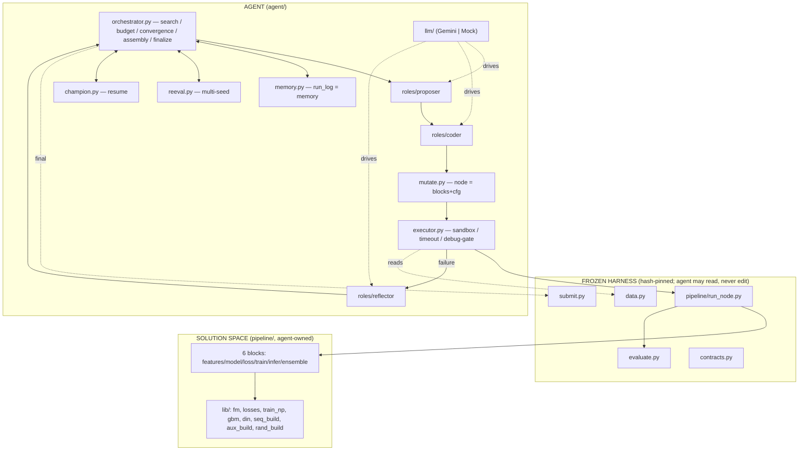

# COMPLETE.md — The Whole System, End to End

**Single source of truth for the KuaiRand-Pure Autonomous ML Research Agent.**
This document is written for a coding agent (or engineer) opening this repository for the first time.
It consolidates *everything*: the problem, the architecture, the frozen trust boundary, every file, the
full math, every implemented feature and improvement, how to run and test, known issues, and how to
extend the system safely. If you read only one document, read this one.

> **Companion docs** (this file supersedes and unifies them; consult them for extra prose): `README.md`
> (the original walkthrough), `docs/DESIGN.md` (the *why*), `docs/MATH.md` (derivations — **note it is
> stale on Lever E**, see Part VII), `docs/INTEGRATION.md` / `docs/IMPLEMENTATION.md` (the six archive
> features), root `IMPROVEMENTS.md` / `IMPLEMENTATION.md` (the seven roadmap improvements), `docs/COMPARE.md`
> (analysis of teammates' archives).

---

## Table of contents

- **Part 0 — Orientation** — what this is, the one rule that matters, how to navigate
- **Part I — The Problem** — task, data, metrics, baselines, the noise floor
- **Part II — Architecture** — two layers, the trust boundary, node model, repo map
- **Part III — The Frozen Harness** — `data.py`, `evaluate.py`, `submit.py`, `run_node.py`, `contracts.py`, guardrails
- **Part IV — Data & Caching** — `datced`, the v6 cache, every sibling cache, the test-label guard
- **Part V — The Solution Space** — the six blocks, the FM backbone, all six Levers (A–F) with code + math
- **Part VI — The Agent** — orchestrator, tree, memory, mutate, executor, reeval, champion, roles, LLM, config, CLI
- **Part VII — The Math** — metrics, FM, losses, DIN, LightGBM, rank-blend, IPS, the noise/selection-bias analysis
- **Part VIII — Integrations & Improvements** — the six archive features (F1–F6), the seven improvements, recent fixes
- **Part IX — The Dashboard** — `hypothesis-ledger.html`
- **Part X — Operations** — environments, running, testing, run outputs
- **Part XI — Known Issues, Gotchas & Findings**
- **Part XII — Extension Guide for Agents**
- **Appendices** — config reference, cache inventory, `run_log.jsonl` schema, glossary

---

# Part 0 — Orientation

## 0.1 What this system is, in one paragraph

An **LLM-driven autonomous agent** that runs the entire ML research loop by itself on the KuaiRand-Pure
video-ranking benchmark: it reproduces the official Factorization-Machine baseline, then proposes
hypotheses, writes/adopts model code, trains, evaluates, reflects, recovers from failures, and finally
assembles an ensemble that beats the baseline — writing a full research log and a validated submission
with zero human intervention. It is built for **TikTok TechJam 2026, Track 2** (Autonomous ML Research
Agent for Recommender Systems), where ~40% of the score is *agent behavior* (autonomy, robustness,
feasibility), not raw model accuracy.

Reference scripted run: FM baseline `primary = 0.6015` → agent ensemble **`0.6050`** (FM + DIN +
LightGBM, rank-blended), submission passes `submit.py --check`, ~700 LLM tokens, ~6 min wall-clock.

## 0.2 The one rule that matters (read before editing anything)

**There is a FROZEN TRUST BOUNDARY.** Five files are hash-pinned in `frozen.lock` and verified at the
start of every run by `agent/guardrails.py::ensure_frozen()`. **Never edit them**:

```
data.py   evaluate.py   submit.py   pipeline/run_node.py   pipeline/contracts.py
```

Any edit to these aborts the run (a SHA-256 mismatch). Everything the agent (or you) may change lives
*downstream* of this boundary: `agent/*`, `pipeline/lib/*`, `pipeline/*_blocks/*`, new `pipeline/*.py`,
`tests/*`, and the standalone dashboard HTML. **If a change seems to require editing a frozen file, it's
the wrong approach — route *around* it** (Features F5 and F6 in Part VIII are the canonical examples of
working around the frozen runner). This boundary is *the* central design decision: it shrinks the failure
surface and makes every run's score trustworthy.

## 0.3 How this codebase is laid out (mental model)

Two layers connected by that boundary:

- **Layer 1 — the solution space** (`pipeline/`): the space of RecSys models, expressed as a small,
  contract-bound *pipeline* of six blocks the agent edits. "The space of models is the space of block
  implementations."
- **Layer 2 — the agent** (`agent/`): a hypothesis-driven **best-first tree search** whose operators are
  LLM roles (Proposer / Coder / Reflector). It is deterministic *policy*; the LLM is the *operator*.

**One node = one experiment** = a snapshot of the six block source files + a `Cfg` (flat hyper-parameter
bag). A fixed runner assembles and executes the snapshot in an isolated subprocess.

## 0.4 Current state (as of this writing)

- All **six archive features (F1–F6)** and **seven roadmap improvements (2A, 1A–D, 3B)** are implemented
  and tested (Part VIII).
- Cache is at **`CACHE_VERSION = 6`** (base + LightGBM + DIN sequences + aux labels + random-exposure).
- Convergence: `eps = 0.002`, `adopt_eps = 0.001`, `N = 6`; `STALL_LIMIT = 6` (still a module constant in
  `orchestrator.py`).
- `resume` (cross-run champion) currently defaults **False**; `unbiased_eval` (Lever E) defaults **False**.
- **`docs/MATH.md` §7 is stale** — it calls Lever E "planned"; it is now implemented (unbiased-eval guard +
  IPS loss). Part VII here is authoritative.

---

# Part I — The Problem

## I.1 The challenge and how it is scored

TikTok TechJam 2026, Track 2. The rubric (from the problem statement) weights:

| Criterion | Weight | Earned by |
|---|--:|---|
| Technical Execution | 35% | score delta over baseline **and** robustness (recover, never crash/stall/diverge) |
| Innovation & Problem Insight | 20% | *what* the agent targeted and *why*; originality |
| Impact & Relevance (Autonomy) | 20% | number of **manual interventions** (fewer is better) |
| Feasibility & Practicality | 15% | tokens + wall-clock — **scored only among submissions that beat the baseline** |
| Presentation & Communication | 10% | the write-up + the auto-emitted logs |

**Consequence:** ~40% of the score is agent *behavior*. Feasibility is *gated behind beating the
baseline* — an agent that stops early to look efficient scores worst (it isn't scored until it clears the
gate). So the agent must beat FM first, then be efficient.

## I.2 The task: within-user ranking

For each user, rank *that user's own* logged impressions by how likely each is a `long_view` (a binary
watch-completion signal). Nothing is retrieved from a global catalog — the candidate set per user is
exactly their logged rows. This is **within-user** ranking, which drives every modeling decision:

- A pure **user-side** feature is constant within a user, so it carries **zero** within-user ordering
  signal. Only features that *vary across a user's impressions* (item-side, author-side, sequence) help.
  The organizers proved this, and it shapes the LightGBM feature set (item-centric) and the "don't add
  static user features" dead-end the Proposer is told to avoid.

## I.3 The data (KuaiRand-Pure)

A short-video feedback log. Downloaded separately (~195 MB, no registration) into
`KuaiRand-Pure/data/` (git-ignored). Key files:

| File | Contents |
|---|---|
| `log_standard_4_08_to_4_21_pure.csv` | the train-window interaction log (file 1) |
| `log_standard_4_22_to_5_08_pure.csv` | the valid+test-window interaction log (file 2) |
| `log_random_4_22_to_5_08_pure.csv` | **randomly-exposed** log (~1.18 M rows) — unbiased, used by Lever E |
| `video_features_basic_pure.csv` | video → author map (+ basic video features) |
| `video_features_statistic_pure.csv` | global per-video engagement stats (used by LightGBM) |
| `user_features_pure.csv` | user-side features (deliberately *not* used — no within-user signal) |

**Splits (by date), fixed by the organizers** (`data.SPLITS`):

| Split | Dates | Rows | Role |
|---|---|--:|---|
| train | 2022-04-08 … 04-21 | 1,141,112 | fit models + all vocab/statistics |
| valid | 2022-04-22 … 04-28 | 124,909 | every accept/reject decision; the search signal |
| test | 2022-04-29 … 05-08 | 170,588 | **hidden**; scored once, at finalize only |
| rand | (whole random log) | 1,186,059 | unbiased-exposure eval (Lever E) — public |

The raw CSV columns include the label (`long_view`) plus auxiliary feedback (`is_click`, `is_like`,
`is_follow`, `is_comment`, `is_forward`, `is_hate`, `is_profile_enter`, `play_time_ms`, …). The frozen
`data.load()` keeps only 7 fields per row; the extra columns are re-read directly from the CSVs by
`aux_build.py` (Lever C) and `rand_build.py` (Lever E).

## I.4 The metrics

`primary = ½(GAUC + nDCG@5)`, computed in the frozen `evaluate.py`. Both halves are within-user. Full
derivations are in Part VII; the short version:

- **GAUC** — mean per-user AUC (Mann-Whitney U), over users with `0 < #positives < #impressions`,
  **weighted by #positives**. Degenerate users (all-pos / all-neg) are excluded (their AUC is undefined).
  → the natural surrogate is a **pairwise** loss (BPR).
- **nDCG@5** — top-weighted, averaged over **all** users; an all-negative user contributes 0 and *is*
  counted (this pulls the ceiling below 1.0). → the natural surrogate is a **listwise** loss (softmax-CE).
- **primary** — the mean of the two.

## I.5 Baselines, the oracle ceiling, and the noise floor

From `baseline_scores.json` (valid / test primary):

| Model | valid primary | test primary | Note |
|---|--:|--:|---|
| random | ~0.4834 | 0.4753 | sanity check only |
| item popularity (`pop`) | ~0.5807 | 0.5715 | non-trained baseline |
| **FM (`fm_official`)** | **0.6016** | **0.5946** | **the baseline to beat** |
| oracle ceiling | 0.8484 | 0.8645 | true labels as scores |

Two numbers govern everything:

1. **The oracle ceiling ≈ 0.86, not 1.0.** On test, 27.1% of users are all-negative (nDCG always 0) and
   9.2% all-positive (nDCG always 1) — no model changes those. Judge progress against **0.86**. The FM
   baseline already captures ~31% of the usable range, so per-lever gains are small and hard-won.
2. **The seed noise floor is `σ ≈ 0.0008`** (FM's std over 5 seeds). Any single-seed delta below this is
   **noise, not signal.** This is *the* most important operational fact: the organizer's convergence rule
   (`eps = 0.002, N = 3`) sits at ~2.5σ deliberately, and much of the agent's rigor machinery (the 2A
   adoption margin, the F4/2A multi-seed confirmation) exists precisely to keep the search from being
   steered by ±0.0005 noise. See Parts VII.7 and VIII.

## I.6 What "success" means

Develop on **train + valid only**. Beat the FM baseline (the scoring gate). The reported score is the
**converged validation-best**, evaluated once on the hidden test. Improvement need not be monotonic — the
best checkpoint is tracked independently of the search path (the *best-checkpoint invariant*), so the
agent can take risky, non-monotonic bets and the submission never degrades.

---

# Part II — Architecture

## II.1 The two-layer thesis

Separate **what** the agent searches (the solution space) from **how** it searches (the agent). This keeps
the agent's creativity confined to well-defined, contract-bound extension points, and keeps the search
machinery model-agnostic — the same orchestrator drives an FM, a LightGBM, or a DIN without knowing
anything about them.

## II.2 The trust boundary (the enforcement mechanism)

`agent/guardrails.py::ensure_frozen(create=True)` hashes the five frozen files and compares to
`frozen.lock` (git-ignored, created on first run). A mismatch raises and aborts. This is why the agent can
never — accidentally, or via a hallucinated "fix" — change the code the score depends on. A second guard,
`executor.check_imports`, statically parses every agent-written block and rejects disallowed imports or
syntax errors *before* it runs.

## II.3 Node = blocks + cfg; the three mutation kinds

A **node** is a full snapshot of the six block source files plus a `Cfg`. The agent mutates a parent node
in exactly one of three ways:

1. **config mutation** — change `Cfg` values only (near-zero tokens). Used for sweeps (`neg_ratio`, `lr`,
   `k`, `aux_weights`, …).
2. **block edit** — the Coder rewrites exactly one block's body; gated by `check_imports`.
3. **block-set adoption** — swap in a whole pre-built model family (`din`, `lgbm`) via
   `Hypothesis.adopt_blockset`. `mutate.materialize_child` copies `pipeline/lib/<name>_blocks/` and — since
   the recent fix — **sets `cfg.model_type = <name>`** so the ensemble's family grouping is correct
   (see Part XI for why this bug mattered).

Full snapshots (not diffs) make every node independently runnable and reproducible, and let two nodes run
concurrently without collision.

## II.4 The macro flow



## II.5 Repository map (every file)

**Frozen harness (never edit):**

| File | Purpose |
|---|---|
| `data.py` | load logs, official date split, encode 5 categorical fields into a flat FM index space |
| `evaluate.py` | the official metrics: `auc` (Mann-Whitney U), `ndcg_at_k`, `evaluate` (GAUC + nDCG@5 + primary) |
| `submit.py` | generate / validate / score submission CSVs (`--make` / `--check` / `--score`) |
| `pipeline/run_node.py` | the fixed node runner: assemble 6 blocks → train → evaluate → emit metrics + scores |
| `pipeline/contracts.py` | `Cfg`, `Meta`, `FeatureSet`, the six block signatures |
| `baseline.py` | the three official baselines: `random`, `pop`, `fm` (the one to beat) |
| `baseline_scores.json` | published reference scores, seed std, convergence rule |
| `ablation_features.py` | organizer proof that static features don't help (not used by the agent) |

**Agent (`agent/`):**

| File | Purpose |
|---|---|
| `run.py` | CLI entry point: `--smoke` / `--mock` / `--faults` / live; `.env.local` key loading |
| `config.py` | `Config`, `Budget`, `Phases`, `LLM` — all tunable knobs |
| `orchestrator.py` | **the control loop**: best-first search, phases, convergence, adoption, recovery, assembly, finalize |
| `tree.py` | `Node` + `SearchTree` (best-first selection with an exploration valve) |
| `memory.py` | append-only `run_log.jsonl` = memory + dedup index + deliverable; `research_table` (1A) |
| `mutate.py` | turn a hypothesis into a node on disk (snapshot blocks, apply cfg delta, diff); `materialize_named` (F3) |
| `executor.py` | sandboxed subprocess runner, timeout, import allowlist, failure classification; `debug_gate` (F5) |
| `guardrails.py` | frozen-file SHA-256 enforcement |
| `datced.py` | build + memory-map the `DataBundle` cache (base + gbm + seq + aux + rand) |
| `reeval.py` | multi-seed re-evaluation (F4) |
| `champion.py` | cross-run champion persist/resume (F3) |
| `llm/driver.py` | `LLMDriver` interface, `Usage`, `MockDriver` (offline) |
| `llm/gemini.py` | `GeminiDriver` — google-genai, structured output, retry/backoff, token accounting |
| `llm/schemas.py` | Pydantic schemas the LLM must return: `Hypothesis`, `BlockEdit`, `RecoveryAction`, `AblationRead` |
| `roles/{proposer,coder,reflector}.py` | the three role wrappers (system prompt + typed `generate` call) |

**Solution space (`pipeline/`):**

| File | Purpose |
|---|---|
| `run_node.py`, `contracts.py` | (frozen — above) |
| `debug_cache.py` | build a subsampled cache for the F5 debug gate |
| `baseline_blocks/*.py` | the FM+BCE baseline expressed as the six blocks; also the ablation control (root node) |
| `lib/fm.py` | numpy Factorization Machine, factored so the loss is pluggable |
| `lib/losses.py` | Lever A: BPR, softmax-CE, BCE, IPS-BCE — each with a `.mode` for the trainer |
| `lib/train_np.py` | the numpy trainer: point / group / pair batching, early stopping, IPS weights |
| `lib/gbm.py` | Lever D: LightGBM LambdaRank on engineered item/author features |
| `lib/din.py` | Lever B: DeepFM + Deep Interest Network (target attention over history) + optional aux head (Lever C) |
| `lib/seq_build.py` | Lever B data: temporally-safe per-user behavior sequences, cached |
| `lib/aux_build.py` | Lever C data: per-row auxiliary labels (click/like/…), cached + alignment-asserted |
| `lib/rand_build.py` | Lever E data: the random-exposure log encoded with train vocab, cached |
| `lib/lgbm_blocks/*.py` | the adoptable LightGBM model-family block set |
| `lib/din_blocks/*.py` | the adoptable DIN model-family block set |

**Tests, docs, dashboard:**

| File | Purpose |
|---|---|
| `tests/mock_moves.py` | scripted hypotheses for `MockDriver` — drives `--mock` / `--faults` without an API |
| `dashboard/hypothesis-ledger.html` | offline, zero-dependency run-log viewer (Part IX) |
| `docs/*.md` | this file + README/DESIGN/MATH/INTEGRATION/IMPLEMENTATION/COMPARE |

---

# Part III — The Frozen Harness

These are the organizer's files (plus the fixed runner + contracts). The agent reads them; any edit
aborts the run. Understanding their exact contracts is essential because *everything downstream depends on
these signatures.*

## III.1 `data.py` — loading, splitting, encoding

- `FIELDS = ['user_id', 'video_id', 'author_id', 'tab', 'dur_bucket']`, `LABEL = 'long_view'`,
  `SPLITS = {'train': (20220408, 20220421), 'valid': (20220422, 20220428), 'test': (20220429, 20220508)}`.
- **`load(data_dir) -> dict[split -> list[row]]`.** Reads `video_features_basic_pure.csv` for the
  video→author map, then the two standard log CSVs **in order**, parsing each row into the 7-tuple
  `(date, user_id, video_id, author, tab, duration_ms, label)`. Filters into train/valid/test by date,
  **preserving file order** (critical: this order defines the submission row order and the sequence
  chronology). Note: only these 7 fields survive — the aux/random columns are dropped here (hence
  `aux_build`/`rand_build` re-read the CSVs).
- **`encode(splits) -> (enc, dim)`.** Fits per-field vocabularies **on train only**; unseen valid/test
  values map to a per-field `UNK` slot. Maps the 5 fields into a **single flat index space** via cumulative
  offsets (the standard FM trick: `user_17 → 17`, `video_3 → 27000+3`), so one embedding table covers all
  fields. `duration_ms` is discretized into 10 train-quantile buckets (`dur_bucket`). Returns
  `enc[split] = (X, y, users)` where `X` is `int32 (N, 5)` of offset indices, `y` is `float32 (N,)`,
  `users` is a list of user_id strings, and `dim` is the total index count (currently **40260**).

**Why this matters for you:** any block gets encoded integer indices, not raw values. To use a feature not
in `FIELDS`, you must cache it yourself (see `aux_build`/`gbm`) — you cannot edit `data.py`.

## III.2 `evaluate.py` — the metrics (the contract everything optimizes)

- **`auc(labels, scores)`** — AUC via the Mann-Whitney U statistic with tie correction; `O(n log n)`,
  equivalent to `sklearn.roc_auc_score`.
- **`ndcg_at_k(labels, k)`** — labels pre-sorted by predicted score; gain `2^rel − 1`, discount
  `1/log2(i+2)`, normalized by the ideal DCG.
- **`evaluate(user_ids, labels, scores, k=5) -> {GAUC, nDCG@5, primary}`** — groups rows by user; GAUC =
  positive-weighted mean per-user AUC over discriminative users; nDCG@5 = mean over all users (all-negative
  users contribute 0 and are counted); primary = mean of the two. It takes three equal-length arrays and is
  fully decoupled from the model.

## III.3 `submit.py`, `baseline.py`, `baseline_scores.json`, `ablation_features.py`

- **`submit.py --make/--check/--score`** — builds a submission from a model, validates format + alignment
  (`row_id` contiguous, one row per split row, finite scores; `(user_id, video_id)` is **not** unique so
  `row_id` is the key), or scores it locally on valid. The agent calls `--check` on its final submission in
  `orchestrator.finalize`.
- **`baseline.py`** — `run_random`, `run_pop`, `run_fm` (the FM to beat: `k=16, lr=1e-3, bs=8192, 40
  epochs, patience 4`). The agent's *root node* reproduces `run_fm` exactly.
- **`baseline_scores.json`** — published scores, the 5-seed std (`0.0008`), and the convergence rule
  (`epsilon=0.002, N=3`). The oracle-ceiling note is the "use 0.86 as the denominator" guidance.
- **`ablation_features.py`** — the organizer's proof that static features don't help; the agent encodes
  that as a hard "don't" in the Proposer prompt.

## III.4 `pipeline/run_node.py` — the runner

Invoked as a module (never imports anything under `agent/`):

```
python -m pipeline.run_node --blocks <dir> --out <dir> --cfg <json> [--cache runs/_cache] [--extra-split test|rand]
```

It `importlib`-loads the six block files from the node's snapshot dir (so concurrent nodes never collide),
then: `feats = build_features(bundle, cfg)` → `model = build_model(feats.meta, cfg)` →
`model = train(model, build_loss(cfg), feats, bundle, cfg)` → `sv = infer(model, feats, "valid")` →
`evaluate(...)` → write `metrics.json` and `val_scores.npy`. When `--extra-split S` is passed (S = `test`
at finalize, `rand` for Lever E), it *also* infers split S and saves `S_scores.npy` (it does **not**
evaluate S — the caller does). It imports only the frozen harness + `agent.datced`.

**On disk, a node is:**
`runs/<run>/nodes/<id>/{blocks/{features,model,loss,train,infer,ensemble}.py, cfg.json, metrics.json,
val_scores.npy, stdout.log}`.

## III.5 `pipeline/contracts.py` — the shapes everything agrees on

- **`Cfg`** — a flat dataclass holding *every* lever knob (see the full field reference in Appendix A). A
  config mutation just changes these values. It round-trips to/from JSON, has `.replace(**kw)` and
  `.from_dict`, and a stable 12-char `.hash()` used for dedup.
- **`Meta`** — `dim`, `field_dims`, `n_fields`: the static description handed to `build_model`.
- **`FeatureSet`** — what a features block returns and model/train/infer consume: `X, y, users, meta`, plus
  optional `seq` (Lever B), `aux` (Lever C), `vstat`. **`FeatureSet` is frozen — you cannot add a field to
  it** (this is why the IPS weights in Lever E are computed in the trainer, not passed via `FeatureSet`).
- **The six block signatures** (the heart of the contract):
  ```python
  build_features(bundle, cfg) -> FeatureSet
  build_model(meta, cfg)      -> model            # exposes .logits/.apply_grad/.predict, or a wrapper
  build_loss(cfg)             -> lossfn(z, batch) -> (loss, g)     # g = dL/dz per row
  train(model, lossfn, feats, bundle, cfg) -> model                # validation-best, early-stopped
  infer(model, feats, split)  -> np.ndarray        # aligned to bundle row order
  combine(base, cfg)          -> np.ndarray         # assembly phase only
  ```

## III.6 `agent/guardrails.py` — immutability enforcement

`ensure_frozen(create=True)` SHA-256-hashes `data.py`, `evaluate.py`, `submit.py`, `pipeline/run_node.py`,
`pipeline/contracts.py`; on first run it writes `frozen.lock`, thereafter it compares and aborts on any
mismatch. Run `python -m agent.run --smoke` after *any* change — it re-verifies the lock, so an accidental
frozen edit fails loudly before anything else.

---

# Part IV — Data & Caching

Re-reading ~106 MB of CSV per experiment would dominate the wall-clock budget, so everything is encoded
**once** into memory-mapped `.npy` files under `runs/_cache/` and loaded in well under a second per node.

## IV.1 `agent/datced.py` — the DataBundle

- **`CACHE_VERSION = 6`** — bump this whenever the cached array layout changes; it forces a one-time
  rebuild. History: 4 = base+gbm+seq, 5 = +aux (Lever C / F1), 6 = +rand (Lever E / 3B).
- **`build_or_load(data_dir, cache_dir, force=False) -> meta`** — idempotent. Rebuilds only when the cache
  is missing or `CACHE_VERSION` changed. It calls the frozen `data.load`/`data.encode` once, then reuses
  those loaded rows to build every sibling cache:
  1. base: per split, `X` (offset indices), `y`, `u` (int user codes for grouping), `vid` (raw video ids,
     for aligned submissions);
  2. `gbm.build_features` — LightGBM features (Lever D);
  3. `seq_build.build` — DIN sequences (Lever B), `L = SEQ_L = 30`;
  4. `aux_build.build` — auxiliary labels (Lever C), then `_assert_aux_aligned` (a **hard** row-alignment
     guard against the base cache's `vid` arrays);
  5. `rand_build.build` — the random-exposure split (Lever E), encoded with train's vocab.
- **`load_bundle(cache_dir) -> Bundle`** — memory-maps the arrays (`mmap_mode='r'`) into a `Bundle`
  (`X, y, users, dim, field_dims, n_fields, cache_dir`). The `cache_dir` field lets a block load its
  sibling caches (gbm/seq/aux) without re-deriving them.

## IV.2 The cache layout (every file)

All arrays are **per-row and row-aligned** across the base + sibling caches (this is what makes the F5
debug subsample and every cross-cache join correct).

| Dir | Per-row arrays | Global meta |
|---|---|---|
| `runs/_cache/` | `{split}_X.npy` (N×5), `_y.npy`, `_u.npy`, `_vid.npy` | `meta.json` (`cache_version`, `dim`, `n_fields`, `fields`, `sizes`) |
| `runs/_cache/gbm/` | `{split}_X.npy` (N×(6+16)), `_y.npy`, `_u.npy` | `meta.json` (`n_features`, `stat_cols`, `sizes`) |
| `runs/_cache/seq/` | `{split}_seq.npy` (N×L), `_slen.npy`, `_tgt.npy` | `meta.json` (`V`, `UNK`, `L`, `sizes`) |
| `runs/_cache/aux/` | `{split}_aux.npy` (N×K), `_vid.npy` | `meta.json` (`tasks`, `sizes`) |
| `runs/_cache/rand/` | `rand_X.npy`, `rand_y.npy`, `rand_u.npy` | `meta.json` (`size`) |

`splits = train, valid, test` (and `rand` is its own single split). The `_vid.npy` arrays are raw video
ids in `data.load()` order — used both to write aligned submissions and as the **alignment oracle** that
`aux_build` is asserted against.

## IV.3 The F6 test-label guard (why `y["test"]` is absent)

`load_bundle` deliberately **does not** load `y["test"]` into the bundle — only `X["test"]` and
`users["test"]` (needed for inference/submission). This is Feature F6: `y["test"]` is never legitimately
read anywhere in the pipeline (run_node evaluates valid only; finalize does test *inference* and writes the
submission from `test_u`/`test_vid`, never labels), so withholding it makes it *physically impossible* for
an agent-written block to peek at hidden-test labels — any `feats.y["test"]` access raises a loud
`KeyError`. The random split's labels **are** kept (`y["rand"]`) because the random log is public data, not
the hidden test.

## IV.4 The sequence cache — temporal safety (`seq_build.py`)

For each impression, the history is that user's **prior** interactions (across all splits, chronological),
truncated to the last `L=30`. Temporal safety is **structural, not a filter**: rows are processed in global
time order (`train`=file1 < `valid` < `test`), and the current item is appended to the user's rolling
`deque(maxlen=L)` **only after** the row's history has been snapshotted — so a row can never see its own
outcome or any future row. `build()` writes `{split}_tgt/seq/slen.npy` (target video id, left-padded
history ids, true length) plus a video vocab of size `V` (`0`=PAD, `V+1`=UNK).

## IV.5 The aux cache — Lever C alignment (`aux_build.py`)

The frozen `data.load()` drops the aux columns, so `aux_build` re-reads the two standard log CSVs and
mirrors `data.load`'s exact file-order + date filter (importing `data.SPLITS`), producing per-row binary
labels for `AUX_COLUMNS = {click, like, follow, comment, forward}`. Because it re-derives row order
independently, `datced._assert_aux_aligned` compares its per-row `video_id` against the base cache's
`{split}_vid.npy` and **raises** on any drift — a silent misalignment would misattribute every aux label.
(Verified aligned: 1,141,112 train rows, positive rates click≈0.46, like≈0.019, follow≈0.001.)

## IV.6 The random-exposure cache — Lever E (`rand_build.py`)

Reads `log_random_4_22_to_5_08_pure.csv` into `data.load()`'s 7-tuple shape, then encodes it **with train's
vocab** via `encode({"train": train_rows, "rand": rand_rows})` so its ids align with the base cache's index
space (unseen users/videos → UNK; verified: `max id 40258 < dim 40260`). Caches `rand_X/y/u`.
`load_rand(cache_dir)` returns `(users, labels)` for the orchestrator's unbiased eval. The random log's
`long_view` positive rate (~0.085) is far below the biased valid rate (~0.44) — which is exactly the
exposure-bias signal Lever E surfaces.

---

# Part V — The Solution Space (the six blocks + the Levers)

The agent's search space is a set of composable **levers**, each realized as block code the agent can
write or adopt. All losses share one interface (`lossfn(z, batch) -> (loss, g)` with `g = dL/dz` per row),
so the model and the objective are cleanly separated. This part is the *catalog* of what the agent can
build; Part VII has the full math.

## V.1 The six blocks and how the baseline realizes them

A node's six blocks (`features/model/loss/train/infer/ensemble`) are executed by the fixed runner in that
order. The **root node** copies `pipeline/baseline_blocks/`, which is the FM+BCE baseline *and* the
ablation control:

| Block | Baseline behavior | Contract |
|---|---|---|
| `features.py` | `build_features(bundle, cfg)` returns a `FeatureSet` wrapping `bundle.X/y/users` + `Meta` | returns `FeatureSet` |
| `model.py` | `build_model(meta, cfg)` builds `FMModel(meta.dim, k=cfg.k)` | exposes `.logits/.apply_grad/.predict` |
| `loss.py` | `build_loss(cfg)` returns `PointLoss` (BCE) — or, once the agent rewrites it, routes through `make_loss(cfg)` | `lossfn(z, batch) -> (loss, g)` |
| `train.py` | `train(...)` calls `train_np.fit(...)`, early-stopping on valid primary | returns the val-best model |
| `infer.py` | `infer(model, feats, split)` = `model.predict(feats.X[split])` | np.ndarray aligned to row order |
| `ensemble.py` | `combine(base, cfg)` — passthrough / mean (assembly is done in the orchestrator) | np.ndarray |

The agent's very first move is typically to rewrite `loss.py` to route through `make_loss`, turning loss
choice into a config knob (`loss_type`).

## V.2 The FM backbone — `pipeline/lib/fm.py`

`FMModel` is a numpy Factorization Machine **factored so the loss is pluggable**:

- `logits(X) -> (z, cache)` — the forward pass. Each of the 5 fields contributes one active index; with
  embeddings `E = V[X]` (shape `F×k`) and per-field linear weights `W[X]`, the logit is
  `z = b + Σ W_i + ½ Σ_f[(Σ_i E_{i,f})² − Σ_i E_{i,f}²]`. The bracket is the standard `O(Fk)` identity for
  the 2nd-order interaction (Part VII.2).
- `apply_grad(X, g, cache, grad_clip)` — the backward pass given the **per-row loss gradient** `g = dL/dz`.
  Since `∂z/∂W_i = 1` and `∂z/∂E_{i,f} = S_f − E_{i,f}` (with `S_f = Σ_i E_{i,f}`), it scatters
  `np.add.at(gW, X, g)` and `np.add.at(gV, X, g[:,None,None]*(S[:,None,:]-E))`, then does an Adam step.
- With the BCE gradient `g = σ(z) − y`, this reproduces `baseline.py`'s FM **exactly** (the M0 gate:
  `primary_valid = 0.6015`). This factoring is the key move: the FM knows nothing about the objective; any
  loss producing `g` drives the same backbone.

## V.3 Lever A — loss alignment (`lib/losses.py` + `lib/train_np.py`)

The organizers' #1 hint: the baseline optimizes *pointwise logloss* but is scored on *ranking* metrics. The
loss should match the metric. `make_loss(cfg)` returns one of:

| `loss_type` | class | `.mode` | targets | note |
|---|---|---|---|---|
| `bce` | `PointLoss` | point | — (control) | reproduces the baseline |
| `bpr` | `PairLoss` | pair | GAUC | within-user pairwise; **the winning lever** (0.6015→0.6036) |
| `softmax_ce` | `SoftmaxLoss` | group | nDCG@5 | listwise; **overfits here** (0.5997, below baseline) |
| `ips_bce` | `PointLoss` (+ trainer weights) | point | debiasing | Lever E; inverse-propensity-weighted BCE |

Each loss returns `(loss, g)` with `g = dL/dz` per row and declares a `.mode` so `train_np.fit` dispatches
the correct batching:

- **`_fit_point`** — random minibatches (BCE / IPS-BCE); byte-identical to the baseline loop. For
  `ips_bce` (or `cfg.ips`), it precomputes inverse-item-popularity weights (`_ips_weights`) and passes them
  in `batch["w"]`.
- **`_fit_group`** — packs whole user groups per batch (listwise softmax needs a user's full impression
  set together).
- **`_fit_pair`** — fully-vectorized BPR: `_build_pair_index` precomputes per-user positive rows + a flat
  negative pool with `(start, len)` offsets, so each epoch samples `neg_ratio` negatives per positive with
  pure numpy (an earlier per-positive loop was ~50× too slow).

All three early-stop on validation primary and restore the best parameters.

**Key empirical finding:** BPR beats FM; listwise softmax-CE does *not* — it overfits the high-cardinality
ID embeddings (peaks at epoch ~2, then declines below baseline). The loss↔metric thesis holds for the
pairwise (AUC) surrogate here, not the listwise one.

## V.4 Lever B — DeepFM + Deep Interest Network (`lib/din.py` + `lib/seq_build.py` + `lib/din_blocks/`)

User behavior sequences are the organizers' single highest-ceiling unexplored direction. `DIN` (torch)
combines two parts:

1. **A Deep Interest Network** — a local attention MLP weights each history-video embedding by its
   relevance to the target: `a = MLP([e_h, e_t, e_h⊙e_t, e_h−e_t])`, masked, summed **without softmax**
   (DIN's signature) into an interest vector `u`.
2. **A DeepFM part** over the base 5 fields (FM linear + 2nd-order cross), so the model **keeps the
   `user_id × video_id` memorization** that pure attention lacks.

The final logit `z = z_fm + MLP([u, e_t, base_sum])`. Training (`fit_din`) uses BPR or BCE (torch autograd),
early-stops on valid primary, and uses the GPU when `torch.cuda.is_available()`. **Key finding:**
pure-sequence DIN *underperforms* FM (0.5895) — attention alone can't beat `user_id × video_id`; adding the
DeepFM part lifts it to **0.6031**.

The `din_blocks/` set (`features` loads seq + optional aux, `model` builds `DIN`, `train` calls `fit_din`,
`infer` predicts) is **adopted wholesale** via `adopt_blockset:"din"`.

## V.5 Lever C — multi-task auxiliary heads (Feature F1; `din.py` aux head + `aux_build.py`)

The DIN grows a **second head** on its shared deep trunk that predicts a user's *other* reactions
(`click/like/follow/comment/forward`) while the primary head predicts `long_view`. Training minimizes
`primary_loss + Σ_k w_k · bce(aux_k)`. Enabled via `adopt_blockset:"din"` + config
`{"aux_tasks":["click","like"],"aux_weights":[0.1,0.1]}`.

- `DIN.__init__(..., n_aux)` builds `self.trunk` (shared), `self.head` (primary), and `self.aux_head`
  (aux, only when `n_aux>0`). `forward` returns `(primary, aux_logits)`; the primary formula is unchanged.
- `fit_din` adds the weighted aux-BCE term on whatever rows it forwards; `din_blocks/features` populates
  `FeatureSet.aux` from the aux cache when `cfg.aux_tasks` is set; `din_blocks/model` passes
  `len(cfg.aux_tasks)` as `n_aux` (and raises `NotImplementedError` for `mtl_arch != "shared"` — MMoE/PLE
  are deliberately deferred).
- **Inference is unchanged** (primary head only), so no submission impact. Auxiliary supervision is a
  *regularizer* that adds ensemble diversity. Whether it helps is the agent's to discover empirically.

## V.6 Lever D — LightGBM LambdaRank (`lib/gbm.py` + `lib/lgbm_blocks/`)

A gradient-boosted tree ranker with a **complementary inductive bias** (axis-aligned splits on tabular
features) to the embedding models. `train_ranker` fits `objective='lambdarank'` with `query` groups =
users on **leakage-safe, item-centric** engineered features (item/author smoothed `long_view` rates from
train only, log counts, duration, tab, 16 global engagement columns z-scored on train). Standalone it's
modest (~0.6021); its value is *diversity* for the ensemble. Adopted via `adopt_blockset:"lgbm"`.

## V.7 Lever E — unbiased-exposure eval + IPS (Feature 3B; `rand_build.py` + losses/train + orchestrator)

Uses the random-exposure log two ways:

1. **Unbiased-eval guard** (gated by `cfg.unbiased_eval`, default off; fm-family only in v1). The main
   `run_node` call passes `extra_split="rand"`, producing `rand_scores.npy`; the orchestrator evaluates it
   against the cached public rand labels and logs `primary_rand` alongside `primary_valid`. A model that
   scores well on biased valid but poorly on random exposure is exploiting exposure-policy bias — verified
   on FM: **valid 0.6015 vs rand 0.364, a +0.24 gap.**
2. **IPS-weighted training** (`loss_type="ips_bce"` or `cfg.ips`). `train_np._ips_weights` computes
   inverse-item-popularity weights (`1/√freq`, mean-normalized) from train item frequency; `PointLoss`
   applies them per row. Down-weighting over-exposed items counters popularity bias.

**Scope note (v1):** the unbiased-eval path runs for `model_type=="fm"` only — DIN/LightGBM would need
`seq`/`gbm` rand caches (a documented follow-on). IPS is fully implemented and self-contained.

## V.8 Lever F — the ensemble (`orchestrator.assemble` + `finalize`)

After the search, the agent blends the **best node of each model family** in **rank space**:

1. Group viable nodes (`status ∈ {root, improved, no_gain}`) by `cfg.model_type`; keep the best per family;
   take the top ≤3 with saved `val_scores.npy`. **Needs ≥2 families**, else fall back to single best.
2. Convert each member's valid scores to **within-user percentile ranks** (`_per_user_rank`) — monotone
   (can't hurt a single model) and scale-free (so FM logits, DIN logits, and LightGBM outputs combine).
3. Grid-search blend weights (`_weight_grids`: simplex step 0.1 for 3 members, a 1-D sweep for 2) to
   maximize valid primary; accept the blend only if it beats the best single member.
4. `finalize` re-runs the chosen members on **test**, blends with the tuned weights, writes
   `best/submission_test.csv`, and validates with `submit.py --check`. Reference: `w=(0.3,0.4,0.3)` over
   (FM, DIN, LightGBM) → **0.6050 > 0.6036** single.

> **Critical dependency (see Part XI):** the ensemble groups by `cfg.model_type`. If an adopted DIN/LGBM
> node is mislabeled `fm` (the bug the recent `mutate.py` fix corrected), all nodes collapse into one
> family and no ensemble forms. This is why `materialize_child` now sets `cfg.model_type = adopt_blockset`.

## V.9 The adoptable block sets (`lib/din_blocks/`, `lib/lgbm_blocks/`)

Each is a full six-block set that `adopt_blockset` swaps in wholesale. They are thin: they load the
relevant sibling cache (seq+aux for DIN, gbm features for LGBM), build the family model, and delegate
training to the lib (`fit_din` / `train_ranker`). `loss.py`/`ensemble.py` are typically no-ops (the
objective lives inside the torch/booster trainer; assembly is the orchestrator's job). Levers **not yet
built**: `mtl_arch` routing (MMoE/PLE), a native LambdaRank numpy loss, and the DIN/LGBM unbiased-eval
extension.

---

# Part VI — The Agent

A hypothesis-driven **best-first tree search**. The orchestrator is deterministic *policy*; the LLM roles
are the *operators*.

## VI.1 `orchestrator.py` — the control loop

Module constants: `BLOCK_SRC = "pipeline/baseline_blocks"`, `STALL_LIMIT = 6`, `FM_VALID = 0.6015`.

### `run(cfg, driver, run_id=None, max_iter=None, verbose=True)`

1. `guardrails.ensure_frozen(create=True)` + `datced.build_or_load(...)` (build/reuse the cache).
2. **Root node** — `mutate.materialize_root` copies the baseline blocks, `executor.run_node` runs them,
   asserts FM is reproduced (~0.6015). This satisfies "reproduce the baseline" and self-checks the harness.
3. **Champion resume (F3)** — if `cfg.resume` and a champion exists, materialize it as a node (parent=root),
   **re-validate it under the current cache** (never trust the stored score across a `CACHE_VERSION`
   change), and add it as an expandable `status="improved"` node. (Default `resume=False`.)
4. **Iterate** (`_iterate`) until a stop condition; each iteration wrapped in `try/except` so one bad step
   can never kill the run.
5. **Stop** on convergence, iteration cap, wall-clock ceiling, or a stall streak (below).
6. **`finalize`** — multi-seed re-eval, ensemble assembly, submission, champion save.

### Stop conditions

The `while` loop continues while: `it < maxit` **and** `wall < wall_limit` **and**
`not _converged(best_series, eps, N)` **and** `stall < STALL_LIMIT`. So there are four stop conditions:

- **Convergence** — `_converged(best_series, eps, N)` fires when the global best-so-far hasn't improved by
  more than `eps` over the last `N` accepted iterations: `len(best_series) > N and (best_series[-1] −
  best_series[-1-N]) <= eps`. `best_series` appends `tree.best().score()` only on **scored** nodes
  (improved/no_gain) — duplicates/no-ops/failures don't append. Defaults `eps=0.002, N=6`.
- **Stall** — `STALL_LIMIT` (6) consecutive no-op/duplicate/failed/no_gain iterations. Governed by the
  *return value* of `_iterate` (`0` on improvement resets the counter; `stall+1` otherwise).
- **Iteration cap** (`max_iter`) and **wall-clock** (`budget.wall_clock_hours`).

> **Operational note (Part XI):** with the global best plateaued (nothing beats it by `eps`), convergence
> fires ~7 scored nodes after the last improvement *regardless of `STALL_LIMIT`*. So raising `STALL_LIMIT`
> alone won't lengthen a converged run — you must also raise `N` (which deviates from the organizer's
> `N=3` and costs compute/overfit-risk).

### `_iterate(...)` — one iteration

1. `parent = tree.select(explore_p, rng)` — best-first with an ε exploration valve.
2. `hyp = proposer.propose(driver, build_proposer_context(...), ...)` — a `Hypothesis`.
3. Classify: `delta` (config), `adopt` (block-set), `is_block` (block edit). A no-op hypothesis (nothing to
   change) → `stall+1`.
4. If a **block edit**: `coder.code(...)` → `BlockEdit`. **Honest rejection (1D):** if `be.implementable`
   is False, log `not_implementable` and skip (no run). Else `check_imports` gates syntax/imports.
5. `mutate.materialize_child` writes the node (snapshot blocks — the parent's, or the adopted set; apply
   cfg delta; sync `model_type` for adoptions; unified diff). `signature = cfg.hash + diff.hash` is checked
   against memory — **duplicates are skipped** (`stall+1`).
6. **Debug gate (F5):** for torch nodes (`model_type ∈ {din,bst}`), `executor.debug_gate` runs a fast
   subsampled pass; a failure routes to `_recover`, a pass logs `debug gate ok`.
7. `executor.run_node(..., extra_split="rand" if unbiased_eval and fm else None)` — the full run. On
   `Failure`, `_recover` (one bounded attempt).
8. On success: `status = "improved" if pv > parent.score() + adopt_eps else "no_gain"` (2A adoption
   margin). **2A two-level confirmation:** if this node would be a *new global best*, `reeval.confirm` runs
   it on extra seeds and reverts it to `no_gain` if the seed-mean doesn't hold. **Lever E:** if
   `unbiased_eval` and fm, evaluate `rand_scores.npy` → `primary_rand`. Then `tree.add(node)`,
   `mem.append(_record(...))`, `best_series.append(tree.best().score())`.

### `_recover(...)` — the failure taxonomy

`executor` classifies failures into `code` / `timeout` / `numerical`. `_recover` calls the Reflector,
which returns a `RecoveryAction`:

| Failure | Trigger | Recovery |
|---|---|---|
| `code` | non-zero exit / traceback | `patch_retry` (Reflector supplies corrected block source, re-run) → else abandon |
| `timeout` | exceeds the per-iter slice | `degrade` (smaller `L`/epochs via a config delta, re-run) → else abandon |
| `numerical` | NaN/Inf primary | `degrade` (grad-clip, lower lr) → else abandon |
| — | node worse than parent | recorded `no_gain`; the best-checkpoint invariant means the submission never degrades |

Every failure/recovery is logged in the node's `events[]`. Even if every branch failed, `finalize` still
emits the best valid submission. (Verified via `--faults`: an injected crash is caught, patched,
retrained, and the run finishes with a passing submission.)

### `finalize(...)` — assembly + submission

- **Multi-seed best (F4):** `_multiseed_best` re-ranks the top-`recheck_top_k` viable nodes by seed-mean
  (`reeval.confirm`), guarding the single-best pick from selection bias; records per-seed scores in the
  report.
- **`assemble`** (Lever F, V.8) — the rank-blend ensemble.
- Writes `best/submission_test.csv` (validated by `submit.py --check`), `resource_report.json` (final
  score, delta over FM, ensemble info, `ablation_best_by_lever`, `reeval` summary, resource totals), and
  `results.md`. Updates the persisted champion if this run beat it (F3).

### `_record(...)` — the run-log schema

Each node appends one JSON line with: `iter, phase, node_id, parent_id, lever, hypothesis,
problem_identified` (1B), `config` (full `Cfg`), `code_diff, metrics` (`{GAUC, nDCG@5, primary_valid,
primary_unbiased}`, plus `primary_valid_seedmean`/`primary_rand` when present), `status, events, cost`
(`{input_tokens, output_tokens, wall_clock_s}`), `signature`. See Appendix C.

## VI.2 `tree.py` — the search tree

- **`Node`** — `id, parent, phase, cfg, block_dir, lever, hypothesis, problem` (1B), `metrics, status`.
  `.score()` returns validation primary (or `−inf` if failed).
- **`SearchTree`** — `add`, `best()` (highest-scoring viable node; viable = `metrics is not None and status
  ∈ {root, improved, no_gain}`), and `select(explore_p, rng)` = **best-first with an ε exploration valve**
  — usually expands the current best, but with probability `explore_p` expands a random viable node (cheap
  insurance against local optima). Failed/duplicate nodes are recorded but not expandable.

## VI.3 `memory.py` — run-log = memory = deliverable

- `append(rec)` writes one JSONL line and updates the dedup set (`signature`).
- `seen(sig)` / `note_seen(sig)` — the **global** duplicate guard (any prior node, stronger than a
  last-N-window). Checked in `_iterate` *before* any run.
- `best()` — current validation-best record.
- `recall(lever, k)` — recent records (legacy; superseded by `research_table`).
- **`research_table()` (1A)** — a *synthesized* scientific state for the Proposer: **confirmed** findings
  (improved nodes), **rejected** (no_gain/abandoned), **best-per-lever**, and **untried levers**. Rule-based,
  no extra LLM call.
- `resource_totals()` — tokens + wall-clock + iteration count for the report.

## VI.4 `mutate.py` — nodes on disk

- `materialize_root` — snapshot the baseline blocks + a fresh `Cfg(seed)`.
- **`materialize_child`** — copy the parent's blocks (or `pipeline/lib/<adopt>_blocks/` for a block-set
  adoption), `apply_delta(parent.cfg, config_delta_json)`, **`cfg.replace(model_type=adopt)` when adopting**
  (the family-label fix), overwrite the one edited block, compute the unified diff.
- `materialize_named` (F3) — snapshot an external block set (a saved champion) into a node.
- `signature(cfg, diff)` = `cfg.hash() + ":" + sha256(diff)[:12]` — the dedup key.

## VI.5 `executor.py` — sandbox + gates

- `run_node(blocks_dir, out_dir, cfg_path, cache_dir, timeout_s, extra_split=None) -> (metrics | Failure,
  wall_s)` — launches `python -m pipeline.run_node` as a subprocess with `capture_output`, a timeout, and a
  forced-UTF-8 env (`utf8_env`; Windows pipes default to cp1252). Classifies outcomes into a metrics dict
  or a typed `Failure(kind ∈ {code, timeout, numerical}, detail)`.
- `check_imports(source)` — statically parses an agent-written block; rejects disallowed imports (allowlist:
  numpy/torch/lightgbm/scipy/sklearn/pipeline/data/evaluate/stdlib) or syntax errors **before** it runs.
- **`debug_gate(blocks_dir, cfg, cache_dir, scratch_dir, ...)` (F5)** — builds a subsampled cache
  (`debug_cache.build`), runs the node with capped epochs on it, and returns a `Failure` (routed to
  recovery) or a metrics dict; a fast crash/sanity gate for expensive torch nodes.

## VI.6 `debug_cache.py` (F5), `reeval.py` (F4), `champion.py` (F3)

- **`debug_cache.build(cache_dir, out_dir, n_train, n_other, seed)`** — a **row-consistent** subsample of
  every per-row cache array (`PER_ROW` maps base/gbm/seq/aux → array stems), with sibling metas copied and
  `sizes` patched. Coherent because all cache arrays are per-row aligned.
- **`reeval.confirm(block_dir, cfg, orig, current_best, cache_dir, timeout, out_root, seeds, eps) ->
  (accept, mean, per_seed)`** — re-runs a node under extra seeds (via `cfg.replace(seed=s)` + `run_node`),
  decides on the **seed-mean** with a short-circuit (skip extra seeds if the single seed can't even beat
  `current_best`).
- **`champion.{load, save}`** — persists the best single node (blocks snapshot + `cfg.json` +
  `champion.json` meta) under `runs/_champion/`, so a later run can resume from the high-water mark.

## VI.7 `config.py` — the knobs

`Config` nests `Budget`, `Phases`, `LLM` and holds the feature flags. Current defaults (full reference in
Appendix A):

- `Budget`: `max_iter=50, wall_clock_hours=6, per_iter_timeout_s=900, eps=0.002, N=6, adopt_eps=0.001` (2A).
- `Phases`: `breadth_until=12, depth_until=40, ablation_every=6, explore_p=0.15`.
- `LLM`: per-role Gemini model ids, `temperature=0.4`, `max_retries=5`.
- Feature flags: `debug_gate=True, debug_train_n=20000, debug_other_n=10000, debug_epochs=2` (F5);
  `recheck=True, recheck_seeds=(1,2), recheck_top_k=3` (F4); `resume=False, champion_dir="runs/_champion"`
  (F3); `unbiased_eval=False` (3B).
- `Config.load(path)` optionally merges `agent/config.yaml` over the defaults (any field is overridable,
  e.g. `resume: true`).

## VI.8 The roles (`agent/roles/`) and the LLM (`agent/llm/`)

- **`roles/proposer.py`** — the Proposer system prompt (levers playbook, dead-ends, **problem-first
  instruction (1B)**, the Lever-C adoption hint). `build_proposer_context` (in the orchestrator) feeds it:
  phase + budget, the **budget-tier directive (1C)**, the FM baseline, the current best, and the
  **synthesized research table (1A)**.
- **`roles/coder.py`** — the Coder system prompt (rewrite one block, import allowlist, **honest-rejection
  instruction (1D)**).
- **`roles/reflector.py`** — the Reflector (failure traceback → `RecoveryAction`).
- **`llm/schemas.py`** — the Pydantic schemas Gemini must return (structured output, so parsing never
  fails): `Hypothesis` (`problem_identified` first (1B), `lever, statement, rationale, mutation_kind,
  target_block, config_delta_json, adopt_blockset, expected_metric, expected_gain`), `BlockEdit`
  (`target_block, new_source, imports_used, implementable, reason, notes` — `implementable/reason` are 1D),
  `RecoveryAction`, `AblationRead`.
- **`llm/driver.py`** — the `LLMDriver` interface, `Usage` token accounting, and **`MockDriver`** (replays
  a scripted list of moves; drives `--mock`/`--faults` offline; its moves-exhausted branch returns a
  well-formed no-op `Hypothesis`).
- **`llm/gemini.py`** — `GeminiDriver` over `google-genai`: structured output, exponential-backoff retries,
  `usage_metadata` token counts. `google` is imported lazily so the Mock path needs nothing installed.

## VI.9 `run.py` — the CLI

```bash
python -m agent.run --smoke     # M0 gate: build cache, reproduce FM (~0.6015), verify frozen.lock. No LLM.
python -m agent.run --mock      # full loop via MockDriver (tests/mock_moves.py). No API, no credits.
python -m agent.run --faults    # robustness demo: inject failures, verify recovery.
python -m agent.run             # LIVE run driven by Gemini (needs GEMINI_API_KEY; --max-iter to cap).
```

`GEMINI_API_KEY` is read from the env or a `.env.local` file. `--faults`/`--mock` set `explore_p=0` for a
deterministic scripted demo.

---

# Part VII — The Math

Notation: for user $u$, $\mathcal{I}_u$ is their impressions; $y_i\in\{0,1\}$ is `long_view`; $z_i$ is the
model logit; $\sigma(x)=1/(1+e^{-x})$. This part is authoritative and **updates `docs/MATH.md` §7**
(Lever E is now implemented).

## VII.1 The metrics

**AUC as Mann-Whitney U.** For a user with $n^+$ positives and $n^-$ negatives, AUC is the probability a
random positive outscores a random negative. Instead of the $O(n^2)$ double sum, `auc()` sorts by score,
assigns **average ranks** to ties, and uses the rank-sum identity: with $R^+$ = sum of positive ranks,
$$\text{AUC}=\frac{R^+-\tfrac{n^+(n^++1)}{2}}{n^+ n^-}.$$
The numerator is the count of correctly-ordered pairs (the U statistic); average ranks give the ½ tie
credit for free. $O(n\log n)$, tie-correct.

**GAUC** = positive-weighted mean of per-user AUC over discriminative users ($0<n^+_u<|\mathcal{I}_u|$);
all-pos/all-neg users are excluded (AUC undefined). Because it is a sum of per-user pairwise-ordering
probabilities, its natural surrogate is a **pairwise** loss (BPR, VII.3).

**nDCG@k.** With items sorted by score, gain $g_i=2^{y_i}-1$ ($=y_i$ for binary), discount
$1/\log_2(i+2)$: $\text{DCG@}k=\sum_{i=0}^{k-1}\frac{2^{y_i}-1}{\log_2(i+2)}$, normalized by the ideal DCG.
Top-heavy, averaged over **all** users (all-negative → 0, counted). Natural surrogate: a **listwise,
top-weighted** loss (softmax-CE / LambdaRank).

**The 0.86 ceiling.** On test, 27.1% all-negative (nDCG≡0) + 9.2% all-positive (nDCG≡1) → a perfect ranker
reaches GAUC 1.0, nDCG@5 ≈ 0.729, primary ≈ 0.8645. Judge progress against ~0.86.

## VII.2 The Factorization Machine

**Forward** (the $O(Fk)$ trick). With active embeddings $E=V[X]$ and $S_f=\sum_i E_{i,f}$:
$$z=b+\sum_i W_i+\tfrac12\sum_{f=1}^{k}\Big[S_f^2-\sum_i E_{i,f}^2\Big],$$
using $\sum_{i<j}\langle v_i,v_j\rangle=\tfrac12(\|\sum_i v_i\|^2-\sum_i\|v_i\|^2)$.

**Backward — one rule for every loss.** Given per-row $g_j=\partial L/\partial z_j$: since $\partial
z/\partial W_i=1$ and $\partial z/\partial E_{i,f}=S_f-E_{i,f}$, we scatter $\partial L/\partial W_i=g$ and
$\partial L/\partial E_{i,f}=g(S_f-E_{i,f})$, then Adam-update. With BCE's $g=\sigma(z)-y$ this reproduces
`baseline.py` line-for-line → the M0 gate lands on 0.6015 exactly.

## VII.3 Ranking losses (Lever A)

**BPR (AUC surrogate → GAUC).** For within-user $i^+,i^-$, $L=-\log\sigma(d)$ with $d=z_{i^+}-z_{i^-}$;
$\partial L/\partial z_{i^+}=-\sigma(-d)$, $\partial L/\partial z_{i^-}=+\sigma(-d)$. Replacing AUC's step
$\mathbf 1[d>0]$ with the smooth $\log\sigma(d)$ makes $\sum\log\sigma(z_i-z_j)$ a differentiable surrogate
for AUC; summed within-user, it pushes up GAUC. Winning lever: 0.6015→0.6036.

**Softmax-CE (nDCG surrogate → nDCG@5).** Per user, target $p_i=y_i/\sum_j y_j$ (uniform over positives),
model $s_i=\text{softmax}(z/\tau)_i$; $L=-\sum_i p_i\log s_i$, $\partial L/\partial z_i=(s_i-p_i)/\tau$.
This is the ListNet/Plackett-Luce CE; a bound on nDCG (Bruch et al. 2019). *It loses here* — the bare-ID FM
memorizes each user's within-group order and overfits (best epoch ~2, then 0.5997 < baseline).

**IPS-BCE (Lever E debiasing).** Weighted BCE $L=-\frac1B\sum_i w_i[y_i\log\sigma(z_i)+(1-y_i)\log(1-\sigma(z_i))]$,
$g_i=w_i(\sigma(z_i)-y_i)/B$. The weight is inverse-item-exposure propensity $w_i\propto 1/\sqrt{\text{freq}(\text{item}_i)}$,
mean-normalized so the overall gradient scale is unchanged — down-weighting over-exposed (popular) items to
counter popularity/exposure bias. Computed in `train_np._ips_weights` from train item frequency (the loss
can't see item ids, so the trainer supplies the weights via `batch["w"]`).

## VII.4 The DIN model (Lever B)

**Interest unit** (no softmax): $a_h=\text{MLP}([e_h\|e_t\|e_h\odot e_t\|e_h-e_t])$,
$u=\sum_h m_h a_h e_h$. The four-way concat expresses both similarity ($e_h\odot e_t$) and contrast
($e_h-e_t$). **DeepFM part** over the base 5 fields ($z_{\text{fm}}$ = FM linear + cross) supplies the user
identity attention lacks. Final: $z=z_{\text{fm}}+\text{MLP}([u\|e_t\|\sum_i e^{\text{base}}_i])$. Pure DIN
0.5895 → DeepFM+DIN 0.6031.

**Multi-task (Lever C):** a shared trunk $h=\text{trunk}([u\|e_t\|\text{base sum}])$ feeds a primary head
($z$) and an aux head ($\hat a=\text{aux\_head}(h)$); loss $=L_{\text{primary}}+\sum_k w_k\,\text{bce}(\hat
a_k,\text{aux}_k)$. Aux is a training-time regularizer only.

## VII.5 LightGBM LambdaRank (Lever D)

`objective='lambdarank'`, query groups = users. For each within-query pair it scales the gradient by
$|\Delta\text{nDCG}_{ij}|$ (the nDCG change from swapping $i,j$ at their ranks) and fits trees to those
pseudo-gradients — a production-grade LambdaRank whose axis-aligned tabular bias is complementary to the
embedding models. Features are strictly item/author-side (within-user-varying), smoothed on train only.

## VII.6 The rank-blend ensemble (Lever F)

Base learners live on incomparable score scales, and the metric cares only about within-user order, so we
blend in **rank space**. Per user, $r_i=\text{rank}_u(s_i)/(|\mathcal{I}_u|-1)\in[0,1]$ (monotone,
scale-free). Blend $\hat r_i=\sum_m w_m r^{(m)}_i$ over the weight simplex, pick the weights maximizing
valid primary, accept only if it beats the best single. Reference: $w=(0.3,0.4,0.3)$ over (FM, DIN,
LightGBM) → 0.6050. It wins because the families' errors are *uncorrelated* (memorization vs. sequence vs.
tabular).

## VII.7 The noise floor and selection bias (why the rigor machinery exists)

The single most consequential number is the **seed std $\sigma\approx0.0008$** (FM over 5 seeds). Three
consequences drive the agent's safety design:

1. **Any single-seed delta below ~0.0008 is noise.** The organizer's `eps=0.002` (~2.5σ) reflects this.
   The old code adopted on `pv > parent + 1e-9` — effectively zero margin, *below* the noise — so the
   search tree's shape could be decided by ±0.0005 luck. **Improvement 2A** raised adoption to
   `+adopt_eps (0.001)` and convergence `eps` to `0.002`.
2. **Selection bias / winner's curse.** `tree.best()` is an argmax over ~50 noisy single-seed draws, so the
   reported best is *upward-biased*: the max of many noisy estimates overshoots the true best. Concretely
   (observed live): a node's single-seed 0.6036 drops to a ~0.6031 seed-mean. **Features F4 (finalize) and
   the 2A new-best gate (during search)** re-evaluate candidates on the seed-mean of 3 seeds
   ($\sigma/\sqrt3\approx0.00046$) before trusting them, so a lucky single seed can't steer the search or
   the submission.
3. **Why not just raise `N`?** A larger convergence window explores longer but drifts from the organizer's
   `N=3` *definition* of convergence and costs compute (Feasibility) + overfit risk. The chosen posture:
   keep `eps/adopt_eps` above the noise, keep `N` modest, and use multi-seed confirmation rather than
   loosening the stop rule.

---

# Part VIII — Integrations & Improvements (provenance and status)

The system grew in two waves. The **archive features (F1–F6)** were pulled from three teammates' archives
(`archives/aerin`, `archives/jx`, `archives/jon`) after a source-level review (`docs/COMPARE.md` →
`docs/INTEGRATION.md` → `docs/IMPLEMENTATION.md`). The **improvements (2A, 1A–D, 3B)** came from a
competition-readiness review of `archives/jon` plus a verification pass (`IMPROVEMENTS.md` → root
`IMPLEMENTATION.md`). All are implemented. **Every one lives below the frozen trust boundary.**

## VIII.1 The six archive features (F1–F6)

| # | Feature | Source | What it added | Where it lives |
|---|---|---|---|---|
| F1 | Multi-task heads (Lever C) | `aerin/sequence_ranker.py` | shared-trunk aux head on the DIN (click/like/…) + `aux_build` cache | `din.py`, `aux_build.py`, `din_blocks/*`, `datced` (v5) |
| F2 | Hypothesis-ledger dashboard | `jx/hypothesis-ledger.html` | offline run-log viewer, tree-aware, zero-dependency | `dashboard/hypothesis-ledger.html` |
| F3 | Cross-run champion resume | `jx/agent/controller.py` | persist + re-validate the best node across runs | `champion.py`, `mutate.materialize_named`, orchestrator |
| F4 | Multi-seed submission re-eval | `jon/agent/reeval.py` | confirm the finalize pick on a seed-mean | `reeval.py`, `orchestrator.finalize` |
| F5 | Debug-first sample gate | `jon/agent/debug_run.py` | fast crash gate for torch nodes on a subsample | `debug_cache.py`, `executor.debug_gate`, orchestrator |
| F6 | Test-label data guard | `jon/agent/data_guard.py` | withhold `y["test"]` from agent blocks | `datced.load_bundle` |

Key design notes: F1's aux ideas were taken *into* the existing `din_blocks` (not copied as a parallel
block set — the repo already had a more-vectorized BPR sampler and a DIN); F2 uses hand-rolled Canvas (no
Chart.js — truly offline); F5/F6 work *around* the frozen `run_node.py` (F5 subsamples the cache, F6 acts
at load time). What was **rejected**: Aerin's BPR sampler (ours is already better-vectorized), Aerin's DIN
as a parallel block set, Aerin's/JX's linear controllers (inferior to the tree search).

## VIII.2 The seven improvements (2A, 1A–D, 3B)

| # | Improvement | What it added | Where it lives |
|---|---|---|---|
| **2A** | Convergence noise floor + adoption margin | `eps 0.0002→0.002`, new `adopt_eps=0.001`; margined adoption; **two-level new-best multi-seed gate** | `config.py`, `orchestrator._iterate` |
| **1B** | Problem-first schema | required `Hypothesis.problem_identified` (first) + prompt; logged per node | `schemas.py`, `proposer.py`, `mutate`/`_record`, `mock_moves`, `driver` |
| **1C** | Budget-tier directives | EARLY/MID/LATE explore→exploit nudge in the Proposer context | `orchestrator._budget_tier` |
| **1D** | Honest rejections | `BlockEdit.implementable/reason` + coder prompt + `_iterate` short-circuit | `schemas.py`, `coder.py`, orchestrator |
| **1A** | Semantic research memory | `Memory.research_table()` (confirmed/rejected/best-per-lever/untried) replaces the raw ledger | `memory.py`, `build_proposer_context` |
| **3B** | Lever E (unbiased eval + IPS) | random-exposure eval guard + `ips_bce` loss | `rand_build.py`, `datced` (v6), `losses.py`, `train_np.py`, orchestrator, `config` |

What was **already done** (verified, not re-built): the strict duplicate guard (`mutate.signature` +
`mem.seen`, global — item §2B) and the shared-trunk multi-task baseline (that is F1 — item §3A). Design
calls: `adopt_eps=0.001` (not the doc's 0.002 — 0.002 would reject a genuine +0.0016 BPR gain after
seed-mean variance reduction); `N` kept at 6 (deliberately **not** inflated to 15–20, to stay near the
organizer's rule).

## VIII.3 Recent bug fixes (important, subtle)

- **Block-set family label (`mutate.py`).** A live LLM sets `adopt_blockset:"din"` but usually *not*
  `config_delta.model_type`, so adopted DIN/LGBM nodes were mislabeled `model_type="fm"`. Since `assemble`
  groups by `model_type`, all nodes collapsed into one family → **no ensemble** (a live run got a 0.6033
  single instead of a ~0.605 blend). Fix: `materialize_child` now sets `cfg.model_type = adopt`. This also
  correctly arms the F5 debug gate for adopted DIN and prevents a rand-eval `KeyError` on adopted DIN.
- **MockDriver exhausted branch (`driver.py`).** After the moves list runs out, the driver built a
  `Hypothesis` without the new required `problem_identified` (1B) → `ValidationError` (caught, but noisy).
  Fix: the exhausted branch now supplies the field, so post-exhaustion iterations are clean no-ops.

---

# Part IX — The Dashboard (`dashboard/hypothesis-ledger.html`)

A single self-contained HTML file — **no server, no build step, no external dependency** (charts are
hand-rolled on `<canvas>`; only Google Fonts is linked and degrades gracefully). Open it in a browser and
drop a `runs/<id>/run_log.jsonl` onto it (read entirely client-side).

**What it renders** (all mapped to *our* schema, not JX's original):
- KPI cards: nodes evaluated, best validation primary, wall-clock, estimated spend (editable rate).
- **Validation-primary chart — tree-aware:** a **best-so-far envelope** line plus per-node dots **colored
  by lever** (A/B/C/D/F/resume/root). This is the crucial adaptation — a raw per-iteration line would
  zig-zag because the agent is a *branching* search, not a linear one.
- Ranking components (GAUC vs nDCG@5), spend-per-node (+cumulative), wall-clock-per-node (by outcome).
- A metrics table and an expandable node log (hypothesis, config diff, events, cost).

**Schema mapping (vs JX's linear original):** `iter` (not `iteration`), flat `metrics.primary_valid` /
`.GAUC` / `["nDCG@5"]` (not nested `metrics.valid.*`), `cost.{input_tokens,output_tokens,wall_clock_s}`
(not `resource_usage.*`), status vocabulary `{root, improved, no_gain, abandoned, duplicate}` (not
`{ok, failed}`), and no per-iteration test columns (we never score test during iteration). It exposes a
`window.loadText(text, name)` for programmatic/testing use.

---

# Part X — Operations

## X.1 Environments (two Python interpreters)

| Interpreter | Version | torch | Use for |
|---|---|---|---|
| system `python` | 3.14 | `2.13.0+cpu` (no CUDA wheels for cp314) | the canonical env; DIN trains on CPU (~80 s/epoch) |
| `cudaenv/` | 3.12 | `2.6.0+cu124` (**GPU**) | **fast** DIN (~20 s), the recommended test interpreter |

Both have numpy/torch/lightgbm/pydantic/pyyaml/scipy. **FM/LightGBM numbers are numpy-deterministic and
interpreter-independent** (so the FM baseline is 0.6015 on either); only torch (DIN) differs slightly and
runs much faster on `cudaenv`. Invoke a run as e.g. `cudaenv\Scripts\python.exe -m agent.run --mock`. The
subprocess runner inherits `sys.executable`, so all node subprocesses use the same interpreter. `cudaenv/`
is git-ignored.

## X.2 Running

```bash
# install (once): numpy torch lightgbm google-genai pydantic pyyaml scipy
# data: put KuaiRand-Pure/data/ in place (git-ignored)
python -m agent.run --smoke     # ~35 s (reuses cache) — the gate after ANY change
python -m agent.run --mock      # ~6–7 min full loop (GPU); beats baseline, writes a submission
python -m agent.run --faults    # robustness: crash injected, patched, run still finalizes
python -m agent.run --max-iter 15   # LIVE Gemini run (needs GEMINI_API_KEY / .env.local)
```

The first run builds `runs/_cache/` (~60 s at v6); every run after reuses it. A `CACHE_VERSION` bump forces
one rebuild.

## X.3 Run outputs (`runs/<run_id>/`)

| File | What |
|---|---|
| `run_log.jsonl` | one line per node — the research log **and** the agent's memory (Appendix C) |
| `resource_report.json` | final score, delta over FM, ensemble info, per-lever ablation, `reeval` summary, tokens + wall |
| `results.md` | short results table |
| `best/submission_test.csv` | the final submission (passes `submit.py --check`) |
| `nodes/<id>/` | each experiment: `blocks/` snapshot, `cfg.json`, `metrics.json`, `val_scores.npy`, `stdout.log` |

Plus persistent, git-ignored dirs: `runs/_cache/` (the DataBundle) and `runs/_champion/` (the cross-run
champion, when `resume` is on).

## X.4 Testing strategy

- **`--smoke`** — the first gate after any cache/block/frozen change (re-verifies `frozen.lock`, rebuilds
  the cache if `CACHE_VERSION` changed, reproduces FM).
- **`--mock`** — the end-to-end integration test; the scripted moves exercise BPR, softmax, LightGBM, DIN,
  DIN+aux, then assembly/finalize. Add a move to `tests/mock_moves.py` to cover a new path.
- **`--faults`** — verifies the recovery policy (patch + abandon) without a real crash.
- **Targeted unit tests** — small throwaway scripts (run from repo root with `sys.path.insert(0,
  os.getcwd())`) for pieces like cache alignment, `research_table`, schema validation, the IPS loss. This is
  how F1–F6 and the improvements were each verified before the integration run.

---

# Part XI — Known Issues, Gotchas & Findings

- **Convergence vs. stall (operational).** With the global best plateaued, `_converged(eps=0.002, N=6)`
  stops the run ~7 scored nodes after the last improvement, *regardless of `STALL_LIMIT`*. To genuinely run
  longer you must raise `N` too — which drifts from the organizer's `N=3` and costs compute/overfit-risk.
  `STALL_LIMIT` is still a hardcoded constant in `orchestrator.py` (a candidate to promote into `Budget`).
- **`resume: false` does not raise the score.** The champion only changes the *comparison baseline* (what
  is labeled "improved"), not any node's actual score. Cold-starting relabels the first breakthrough as an
  improvement (a few more iterations) but the ceiling (~0.6036 single, ~0.605 ensemble) is unchanged. The
  real lift is always the ensemble at finalize.
- **The ensemble needs family diversity — and it's fragile to labeling.** See VIII.3: a live run produced
  no ensemble because adopted DIN/LGBM nodes were labeled `fm`; the `mutate.py` fix resolves it. If you
  ever see "using best single node" when DIN/LGBM clearly ran, check `cfg.model_type` per node.
- **`FeatureSet` is frozen.** You cannot add a field to it. Anything a block needs beyond `X/y/users/seq/
  aux/vstat` must be computed in the trainer (as IPS weights are) or cached and loaded via
  `bundle.cache_dir`.
- **`bundle` arrays are mmap.** `feats.X["train"]` etc. are `mmap_mode='r'` — wrap in `np.asarray(...)`
  before heavy indexing/mutation.
- **Scripted vs. live autonomy (be honest in write-ups).** The reference `0.6050` run replays scripted
  `MockDriver` moves — "0 runtime interventions" is true for the *machinery*, but the research decisions
  are scripted. Live Gemini runs (real hypotheses, ~5k tokens) do work and demonstrate autonomy (including
  the LLM independently proposing Lever C), but converge earlier and land a bit lower — see the README §14
  and 4A. Don't conflate the two.
- **Not yet built:** `mtl_arch` routing (MMoE/PLE — deliberately deferred); a native numpy LambdaRank loss
  (`Cfg.lambdarank` is reserved; LightGBM supplies LambdaRank); the DIN/LightGBM extension of the Lever E
  unbiased-eval (v1 is fm-only); `primary_unbiased` in the metrics (still `null`); a fully prompt-iterated
  live Gemini run.
- **`docs/MATH.md` §7 is stale** (calls Lever E "planned"); Part VII here is authoritative.

---

# Part XII — Extension Guide for Agents

**Golden rules:** (1) never edit a frozen file (Part 0.2); (2) `--smoke` after every change; (3) all cache
arrays must stay per-row aligned; (4) bump `CACHE_VERSION` on any cache-layout change.

## XII.1 Add a config knob
Add a field to `Cfg` (frozen — but it already has spare fields; only add if truly new *modeling* state) or,
preferably, to `agent/config.py`'s `Config`/`Budget` (agent-side, not frozen). `Config.load` merges
`agent/config.yaml` overrides automatically.

## XII.2 Add a lever / model family (block set)
1. Implement the model in `pipeline/lib/<name>.py`.
2. Create `pipeline/lib/<name>_blocks/{features,model,loss,train,infer,ensemble}.py` honoring the six
   signatures (Part III.5). `features` loads any sibling cache via `bundle.cache_dir`; `model` builds the
   family model; `train` delegates to your lib.
3. If it needs new cached data, add a `<name>_build.py` under `pipeline/lib/`, wire it into
   `datced.build_or_load` (reuse the already-loaded `splits`), **assert row-alignment against the base
   cache's `{split}_vid.npy`**, and bump `CACHE_VERSION`. Add its arrays to `debug_cache.PER_ROW`.
4. It becomes adoptable immediately via `adopt_blockset:"<name>"` (mutate resolves
   `pipeline/lib/<name>_blocks` and now sets `cfg.model_type="<name>"`, so it joins ensemble family
   grouping). Add a one-line hint to the Proposer prompt so the live agent reaches for it.
5. Add a `tests/mock_moves.py` move that adopts it (ideally via `adopt_blockset` *without* setting
   `model_type`, to guard the labeling fix), and run `--mock`.

## XII.3 Working around the frozen runner
`run_node.py` evaluates valid only and can *infer* an extra split (`--extra-split`). To score any other
split (test at finalize, rand for Lever E), infer it via `extra_split` and evaluate the saved scores **in
the orchestrator** against cached labels — never by editing `run_node.py`. F5 (subsampled cache) and F6
(load-time label withholding) are the other two frozen-boundary patterns.

## XII.4 Common pitfalls
- Adding a required field to a Pydantic schema breaks every direct constructor (mock moves + the driver
  exhausted branch) — update them (1B's rollout is the template).
- Grouping/family logic keys on `cfg.model_type` — keep it in sync with the actual blocks (the mutate fix).
- Multi-seed/reeval re-runs cost a full training pass each — keep them bounded (finalize + new-best only).
- The debug gate and Lever E gate on `model_type` — a mislabeled node silently skips (or wrongly triggers)
  them.

---

# Appendices

## Appendix A — Full configuration reference

**`Cfg`** (`pipeline/contracts.py`, frozen; per-node hyperparameters):

| Field | Default | Meaning |
|---|---|---|
| `seed` | 0 | RNG seed (numpy + torch) |
| `use_seq`, `L` | False, 50 | sequence flag / max history (DIN uses the cached `SEQ_L=30`) |
| `use_vstat`, `use_aux` | False, False | feature-inclusion flags |
| `model_type` | `"fm"` | family label: `fm`/`din`/`lgbm`/… (set by `adopt_blockset`; used by `assemble`, debug-gate, Lever E) |
| `k` | 16 | embedding dim |
| `loss_type` | `"bce"` | `bce`/`bpr`/`softmax_ce`/`ips_bce` (Lever A + E) |
| `alpha`, `tau` | 0.5, 1.0 | blend weight / softmax temperature |
| `neg_ratio` | 4 | negatives per positive for BPR |
| `lambdarank`, `group_filter` | False, False | reserved / drop degenerate groups |
| `lr`, `l2`, `epochs`, `batch`, `patience`, `grad_clip` | 1e-3, 1e-6, 40, 8192, 4, 0.0 | training knobs |
| `aux_tasks`, `aux_weights`, `mtl_arch` | (), (), `"shared"` | Lever C (only `"shared"` implemented) |
| `ips` | False | Lever E: enable IPS weighting for point losses |
| `ensemble_members` | () | reserved |

**`Config`** (`agent/config.py`, agent-side): `data_dir`, `cache_dir="runs/_cache"`, `runs_dir="runs"`,
`seed=0`, `gpu="auto"`; F5: `debug_gate=True, debug_train_n=20000, debug_other_n=10000, debug_epochs=2`;
F4: `recheck=True, recheck_seeds=(1,2), recheck_top_k=3`; F3: `resume=False, champion_dir="runs/_champion"`;
3B: `unbiased_eval=False`; nested `Budget`, `Phases`, `LLM`.
**`Budget`:** `max_iter=50, wall_clock_hours=6, per_iter_timeout_s=900, eps=0.002, N=6, adopt_eps=0.001`.
**`Phases`:** `breadth_until=12, depth_until=40, ablation_every=6, explore_p=0.15`.
**`LLM`:** `provider="gemini"`, per-role model ids (`proposer`/`reflector` = a `*-pro`, `coder` = a
`*-flash`), `temperature=0.4, max_retries=5, max_llm_usd=0`.

## Appendix B — Cache inventory (`runs/_cache/`, `CACHE_VERSION=6`)

See IV.2. Summary: base (`{split}_X/y/u/vid`) + `gbm/` + `seq/` + `aux/` + `rand/`, all per-row aligned;
`y["test"]` is deliberately withheld at load (F6); the random split's labels are kept (public).

## Appendix C — `run_log.jsonl` record schema

```json
{
  "iter": 1, "phase": 1, "node_id": "n1", "parent_id": "root",
  "lever": "A", "hypothesis": "...", "problem_identified": "...",
  "config": { ...full Cfg... }, "code_diff": "...",
  "metrics": { "GAUC": 0.67, "nDCG@5": 0.53, "primary_valid": 0.6036,
               "primary_unbiased": null, "primary_valid_seedmean": 0.6031, "primary_rand": 0.38 },
  "status": "improved", "events": [], "cost": { "input_tokens": 160, "output_tokens": 120, "wall_clock_s": 54 },
  "signature": "3dd1..:e3b0.."
}
```
`status ∈ {root, improved, no_gain, abandoned, duplicate}`. `metrics` is `null` for abandoned/duplicate
nodes. `primary_valid_seedmean` appears only when the 2A new-best gate fired; `primary_rand` only when
`unbiased_eval` is on.

## Appendix D — Glossary

- **Lever** — a composable modeling axis: A (loss), B (sequence/DIN), C (multi-task), D (model family /
  LightGBM), E (debias / unbiased-exposure), F (ensemble).
- **Block / block set** — one of the six pipeline files / a full six-file family (`din_blocks`,
  `lgbm_blocks`) adoptable via `adopt_blockset`.
- **Node** — one experiment = a block snapshot + a `Cfg`, run by the fixed runner.
- **Primary** — `½(GAUC + nDCG@5)`, the score. `primary_valid` (search signal), `primary_rand` (unbiased,
  Lever E), `primary_unbiased` (reserved).
- **The frozen boundary** — `data.py`/`evaluate.py`/`submit.py`/`run_node.py`/`contracts.py`, hash-pinned;
  never edited.
- **Best-checkpoint invariant** — the submission is always the validation-best object, tracked
  independently of the (possibly non-monotonic) search path.
- **Noise floor** — `σ ≈ 0.0008`, the FM seed std; deltas below it are noise.

---

*End of COMPLETE.md. This document is the authoritative, consolidated reference; when it disagrees with an
older doc (e.g. `MATH.md` on Lever E), this file wins. Keep it updated when the frozen boundary, the cache
layout, the levers, or the config change.*


